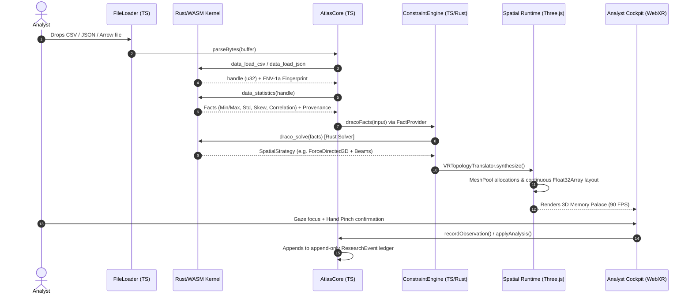

# Nemosyne: The Developer's Complete Guide & System Explainer

**Governing Spec:** [Nemosyne Definitive Vision & Roadmap](Nemosyne_Definitive_Vision_and_Roadmap.md)  
**Technical Architecture:** [ARCHITECTURE.md](ARCHITECTURE.md)  
**Status:** Canonical Developer Onboarding & Maintenance Guide  
**Target Audience:** Software engineers, research engineers, and maintainers building or operating Nemosyne.

---

## 1. 🧭 The Mental Model: Why Nemosyne is Built This Way

Welcome to Nemosyne. Before touching code, you must understand the **three fundamental concepts** that govern every architectural decision in this repository:

```text
┌─────────────────────────────────────────────────────────────────────────────┐
│ 1. INVESTIGATION                                                            │
│    What happened, what was known, what was observed, what was decided,      │
│    and why. (Authoritative, persistent, serializable, graph-structured)     │
├─────────────────────────────────────────────────────────────────────────────┤
│ 2. REPRESENTATION                                                           │
│    How that investigation is spatially expressed for the analyst's task.    │
│    (Explicit SpatialStrategy, explainable, constraint-satisfied via Draco)  │
├─────────────────────────────────────────────────────────────────────────────┤
│ 3. MEMORY PALACE                                                            │
│    The persistent spatial projection of the investigation in 3D WebXR.      │
│    (Derived view: can be discarded and 100% regenerated from Investigation) │
└─────────────────────────────────────────────────────────────────────────────┘
```

### Critical Rules to Remember
- **Rust is the sole analytical authority:** Statistical formulas, clustering, TDA Mapper graphs, and layout coordinate packing are computed in WebAssembly (`wasm/`). **Never write TypeScript fallback formulas** (Principle P2).
- **The Investigation owns meaning:** Three.js meshes, cameras, HUD panels, and WebSockets do not own domain truth. They are transient projections (Principle P3, P5).
- **100% Pure TypeScript:** All files in `src/` and `tests/` are `.ts`. Do not introduce `.js` files. `@typescript-eslint/no-explicit-any` is a blocking error in `src/`.

---

## 2. 🗺️ Directory & Subsystem Map

```text
nemosyne/
├── src/                               # 100% Pure TypeScript application source
│   ├── main.ts                        # Application bootstrap & entry point
│   ├── atlas/                         # Analytical orchestration & guidance (AtlasCore, DatasetSpace)
│   ├── data/                          # Schema definitions & position semantics classification
│   ├── draco/                         # Spatial strategy recommender & 3D layout translators
│   │   ├── layouts/                   # 3D layout drivers (Grid, Force, Time, Geo, Streamline)
│   │   └── evidence/                  # Empirical recommender utility tuner
│   ├── network/                       # WebRTC/WebSocket collaboration & HMAC signed tickets
│   ├── session/                       # Investigation branch manager & NemosyneSession serialization
│   ├── study/                         # 2D-vs-VR experimental study harness & statistical analyzer
│   ├── types/                         # Centralized error registry, hardware matrix, shared types
│   ├── ui/                            # 2D desktop HTML fallback and precision companion
│   ├── utils/                         # Object pools, mesh recycling, color palettes
│   ├── vr/                            # WebXR runtime, Three.js engine & cockpit UI
│   │   ├── input/                     # InteractionMode FSM, Gesture ownership, telemetry
│   │   ├── ui/                        # HandWheel menu, MovablePanel, Transient cards, Status strip
│   │   ├── scalability/               # SpatialIndex, LODManager, Quest field trial suite
│   │   └── trace/                     # UX acceptance gates, hypothesis triage, world context
│   └── wasm/                          # JavaScript bridge to the Rust WebAssembly kernel
├── wasm/                              # Rust / WebAssembly crate (cdylib, wasm32-unknown-unknown)
│   ├── Cargo.toml                     # Dependencies (statify, ndarray, serde, etc.)
│   └── src/
│       ├── lib.rs                     # Canonical WASM ABI exports
│       ├── data/                      # Parsing, FNV-1a fingerprinting, operations, statistics
│       ├── draco/                     # Constraint solver (solver.rs) & utility evidence
│       ├── intent/                    # Natural language intent-to-AST compiler
│       ├── layouts/                   # 3D spatial layout coordinate simulation in native Rust
│       └── provenance.rs              # Execution timing & cryptographic provenance envelopes
├── modules/
│   └── gesture-intelligence/          # Standalone 56-dim gesture classifier & retraining module
├── tests/                             # Vitest unit & integration test suites
│   ├── setup.ts                       # jsdom WebGL / Canvas2D mock environment
│   └── e2e/                           # 4-tier opaque-box end-to-end test suite
└── docs/                              # Project documentation & study specifications
```

---

## 3. 🔄 End-to-End Data Lifecycle Walkthrough

Here is the exact journey of a dataset from raw input to interactive 3D Memory Palace:



---

## 4. ⚡ The Rust / WASM Analytical Kernel & ABI

The Rust WebAssembly kernel (`wasm/src/`) provides deterministic, memory-safe computation.

### 4.1 Handle-Based Memory Architecture
To avoid expensive serialization of large datasets between JS and WASM, datasets live in a Rust-side `DatasetRegistry`:
1. When data is parsed, Rust assigns an integer `handle` (e.g., `handle = 1`).
2. Subsequent operations (`filter`, `cluster`, `statistics`) pass this `handle` and return a new derived `handle`.
3. JavaScript calls `destroyDataset(handle)` when finished to free Rust memory.

### 4.2 Continuous Coordinate Buffers
For 3D layout simulation (e.g. `layout_force_directed_3d`), Rust computes vertex coordinates directly into contiguous linear memory:
```rust
// Rust exports pointer and count
let ptr = positions.as_ptr() as u32;
let len = positions.len() as u32; // [x0, y0, z0, x1, y1, z1, ...]
```
JavaScript reads this via a `Float32Array` buffer view through `RuntimeBridge.ts` with **zero memory copies**:
```typescript
const positions = runtimeBridge.getLayoutPositions(handle);
geometry.setAttribute('position', new THREE.BufferAttribute(positions, 3));
```

### 4.3 Provenance Envelope
Every single kernel call generates a cryptographic provenance record:
```json
{
  "kernelVersion": "0.2.0",
  "kernelAbiVersion": 2,
  "operation": "anomaly_zscore",
  "datasetFingerprint": "a3f89e...",
  "timestampMs": 1724089123456,
  "executionDurationMs": 1.42
}
```

---

## 5. 🥽 Spatial Cockpit & Interaction Architecture

Nemosyne uses an **Analyst Cockpit** model rather than floating 2D menu walls.

```text
               INTERACTION STATE MACHINE (InteractionModeController)
               
                 ┌───────────────┐
                 │   NAVIGATE    │ (Locomotion, HandWheel navigation)
                 └───────┬───────┘
                         │
          ┌──────────────┼──────────────┐
          ▼                             ▼
   ┌──────────────┐              ┌──────────────┐
   │   INTERACT   │              │  TRANSFORM   │
   │ (Panel click,│              │ (Palace scale│
   │  node focus) │              │  & rotation) │
   └──────┬───────┘              └──────┬───────┘
          │                             │
          └──────────────┬──────────────┘
                         ▼
                 ┌───────────────┐
                 │    OBSERVE    │ (Deep inspection, mark moment, findings)
                 └───────────────┘
```

### 5.1 Gaze + Confirm Targeting
Because Quest 3/3S eye and laser tracking suffers from pointer aim-drift (UX-002 / UX-004), critical actions use **coarse gaze focus + explicit hand-pinch confirmation**:
1. User looks at a node or button (`FocusState.focused`).
2. Visual pill glows (`FocusState.armed`).
3. Analyst confirms with index-thumb pinch (`FocusState.confirmed`).

### 5.2 The 3-Level HandWheel
The primary navigation tool is the `HandWheelMenu` positioned at torso height (`camera.y - 0.25m`). It organizes capabilities into 6 analyst intents:
- `ANALYSE`: Filter, Sort, Aggregate, Cluster, Anomalies, TDA Mapper.
- `VIEW`: Layouts (Grid, Force, Time, Geo, Streamline), Perspective resets.
- `DATA`: Dataset loading, Sample catalogs, Export package.
- `STUDY`: Study mode, trial questions, NASA-TLX survey.
- `COLLABORATE`: Room tickets, peer presence, spectator streams.
- `SYSTEM`: Comfort presets, accessibility dwell steppers, exit VR.

### 5.3 Panel Roles & Clutter Reduction
- **Max Two Task Panels Rule:** The system enforces a maximum of 2 task panels open simultaneously. Opening a third automatically minimizes the oldest.
- **Transient Context Cards:** Momentary events (e.g., "Dataset Loaded", "Drift Alert") spawn auto-dismissing cards that vanish after 4 seconds.

---

## 6. 🧪 Research Harness & Empirical Study Engine

The `src/study/` module provides a scientific instrument for comparing **2D desktop controls vs VR spatial environments**:

- **`StudyHarness.ts`**: Runs randomized crossover trials with strict timer tracking and answer captures.
- **`Counterbalancer.ts`**: Balances condition sequences (`A->B` vs `B->A`) via Latin-square matrices.
- **`StudyStatisticalAnalyzer.ts`**: Computes two-sample t-tests, degrees of freedom, p-values, and Cohen's d effect sizes across task completion duration and NASA-TLX workload.
- **`StudyDataExporter.ts`**: Formats trial outputs into standard, reproducible CSV bundles.

---

## 7. 👩‍💻 Developer Cookbooks: How to Extend Nemosyne

### Cookbook 1: Adding a New Rust Analytical Operation

1. **Implement the algorithm in Rust** (`wasm/src/data/operations.rs`):
   ```rust
   pub fn my_custom_transform(dataset: &Dataset, threshold: f64) -> Result<Dataset, String> {
       let mut filtered = dataset.clone();
       // Transform rows...
       Ok(filtered)
   }
   ```
2. **Expose it in `wasm/src/lib.rs`**:
   ```rust
   #[no_mangle]
   pub extern "C" fn data_my_custom_transform(handle: u32, threshold: f64) -> u32 {
       // Lookup dataset, run transform, register new handle, return handle
   }
   ```
3. **Add the typed wrapper in `src/wasm/RuntimeBridge.ts`**:
   ```typescript
   myCustomTransform(handle: number, threshold: number): number {
     return this.exports.data_my_custom_transform(handle, threshold);
   }
   ```
4. **Wire it into `AtlasCore.ts`**:
   ```typescript
   applyCustomTransform(threshold: number): AnalysisResult {
     const newHandle = this._bridge.myCustomTransform(this._currentHandle, threshold);
     // Record event in research ledger...
   }
   ```
5. **Add tests in `wasm/src/data/operations.rs` and `tests/atlas-core.test.ts`**.

---

### Cookbook 2: Adding a New 3D Spatial Layout

1. **Implement the layout in Rust** (`wasm/src/layouts/my_layout.rs`) to compute `[x, y, z]` continuous coordinates.
2. **Export the ABI function in `wasm/src/lib.rs`** (`layout_my_layout`).
3. **Create the TypeScript layout driver** in `src/draco/layouts/MyLayout.ts`:
   ```typescript
   export class MyLayout extends LayoutBase {
     compute(dataset: Dataset, space: DatasetSpace): Float32Array {
       return this.bridge.layoutMyLayout(dataset.handle);
     }
   }
   ```
4. **Register the layout** in `VRTopologyTranslator.ts`.

---

### Cookbook 3: Creating a New Task Panel

1. **Extend `MovablePanel`** (`src/vr/ui/MyNewPanel.ts`):
   ```typescript
   export class MyNewPanel extends MovablePanel {
     constructor() {
       super({
         id: 'my-new-panel',
         title: 'Custom Tool',
         width: 0.6,
         height: 0.4,
         role: 'task' // 'workspace' | 'task' | 'context' | 'diagnostic' | 'transient'
       });
     }
     
     protected renderContent(ctx: CanvasRenderingContext2D): void {
       // Draw high-contrast 2D canvas UI...
     }
   }
   ```
2. **Register with `PanelRolesManager`** and wire click handlers.

---

## 8. 🛡️ Testing, CI Gates & Verification Runbook

All changes must pass the CI gate sequence in exact order:

```bash
# 1. Typecheck (MUST BE 0 ERRORS)
npm run typecheck

# 2. ESLint (MUST BE 0 ERRORS in src/)
npm run lint

# 3. Rust Unit Tests (85+ tests in wasm/)
cargo test --manifest-path wasm/Cargo.toml

# 4. JavaScript / TypeScript Unit & Coverage Tests (217+ files)
npm test
npm run test:coverage

# 5. Production Bundle Build
npm run build
```

---

## 9. 🔍 Debugging & Profiling Runbook

- **Live Dev Endpoints:**
  - `/__ux-trace`: Real-time HUD interaction traces (`logs/ux-trace.jsonl`).
  - `/__remote-logs`: Headset console mirror (`logs/vr-remote-console.log`).
  - `/__loadtest-results`: Automated Quest performance benchmarks.
- **UX Trace Analyzer:**
  ```bash
  node scripts/analyze-ux-trace.mjs
  ```
- **Disabling WASM for Headless Mocking:** Use `tests/helpers/kernelMock.ts` inside Vitest suites.
