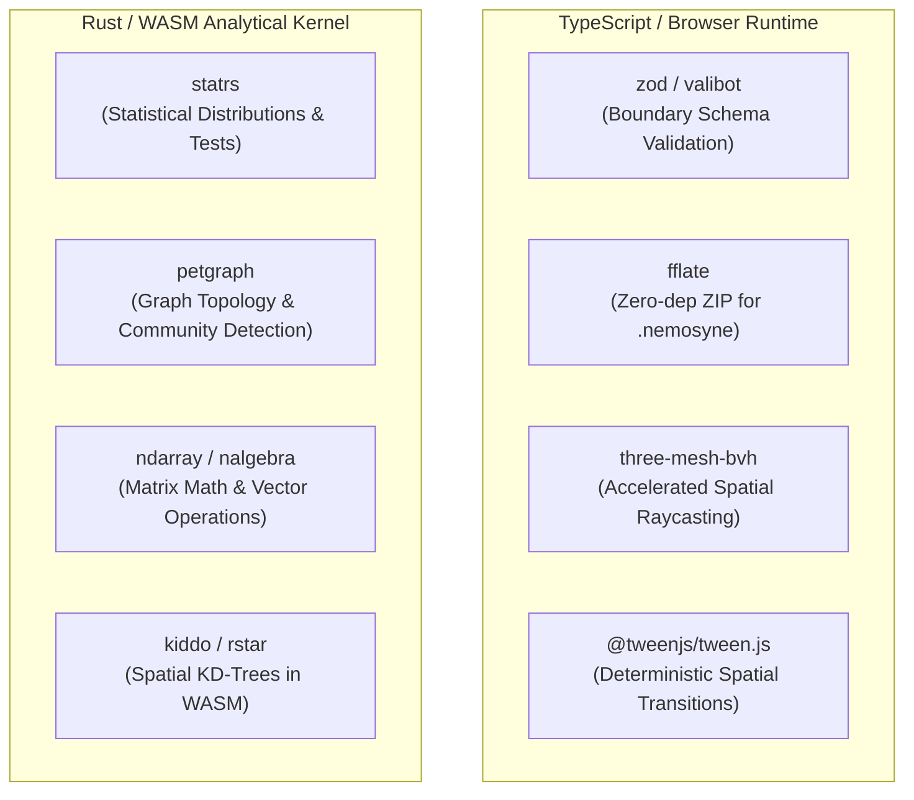

# Open Source Library Adoption & Maintenance Footprint Reduction Proposal

**Status:** Approved Architectural Proposal  
**Target Release:** Limited Public Testing Release (Sprints 27.1–27.6)  
**Governing Vision Reference:** [Nemosyne Definitive Vision & Roadmap](Nemosyne_Definitive_Vision_and_Roadmap.md) (§5.9, §16, §17 — Principle P16: "Build less, integrate more")

---

## 1. Executive Summary

To prepare Nemosyne for a sustainable, reliable **Limited Public Testing Release**, we must reduce our hand-rolled maintenance footprint. Over earlier prototyping phases, several components were built from scratch (e.g., custom serialization logic, custom bounding box math, ad-hoc lerp transitions, and custom schema checkers). 

By adopting trusted, mature, battle-tested open-source libraries with zero or minimal runtime overhead, we can:
1. **Eliminate subtle edge-case bugs** (e.g., memory safety in binary container decompression, mathematical edge cases in spatial raycasting).
2. **Standardize data validation contracts** across boundaries (WASM ↔ TypeScript ↔ Network ↔ Persistence).
3. **Accelerate developer velocity** by relying on widely documented community standards.

---

## 2. Proposed Open Source Adoptions

---

## 3. Detailed Component Analysis & Migration Strategy

### 3.1 Boundary Schema Validation: `zod` or `valibot`
- **Current State:** Hand-rolled runtime checks (`typeof x === 'string'`, manually validating signed room tickets, session JSON, and trial configs).
- **Proposed Library:** [`zod`](https://github.com/colinhacks/zod) (or ultra-lightweight [`valibot`](https://github.com/fabian-hiller/valibot)).
- **Target Surfaces:**
  1. **`.nemosyne` Package Manifests:** Validating `packageId`, `datasetFingerprint`, `kernelVersion`, `abiVersion`, and `integrityManifest`.
  2. **Collaboration Signed Tickets (`SignedTicket.ts`):** Validating HMAC signatures, timestamps, peer roles, and room IDs.
  3. **Research Harness Study Protocols (`FrozenStudyConfig.ts`):** Enforcing immutable trial structures, Latin-square matrices, and participant IDs.
  4. **Analysis Commands (`AnalysisSpec`):** Validating JSON DSL predicates (`eq`, `between`, `in`, `gt`) before sending them across the WASM boundary.
- **Benefits:**
  - Compile-time TypeScript type inference directly from runtime schemas (`z.infer<typeof Schema>`).
  - Bulletproof defense against malformed or malicious payload injections in public test builds.

---

### 3.2 Portable Container Packaging: `fflate`
- **Current State:** Single uncompressed JSON session blobs (`NemosyneSession.serialize()`), which can grow to 10s of MBs and cannot package raw Arrow streams or external assets cleanly.
- **Proposed Library:** [`fflate`](https://github.com/101arrowz/fflate) (Fastest, zero-dependency pure JavaScript/WASM compression library for browser and Node.js).
- **Target Surfaces:**
  - **`.nemosyne` Investigation Packages:** Creating and extracting standard `.nemosyne` ZIP archives containing `manifest.json`, `investigation/graph.json`, `provenance/kernel.json`, and `dataset/data.arrow`.
- **Benefits:**
  - 100% synchronous/asynchronous browser and Node compatibility with zero external binaries.
  - Streaming decompression allowing large datasets to be loaded in memory chunks without freezing the 90 FPS WebXR render loop.

---

### 3.3 Spatial Raycasting & Indexing: `three-mesh-bvh`
- **Current State:** Hand-rolled uniform grid spatial index (`src/vr/scalability/SpatialIndex.ts`) and naive Three.js raycaster loops. On 50k–100k point clouds, raycasting causes frame-time spikes (>15ms) on Quest 3S.
- **Proposed Library:** [`three-mesh-bvh`](https://github.com/gkjohnson/three-mesh-bvh) (Bounding Volume Hierarchy for Three.js).
- **Target Surfaces:**
  - Laser pointer intersection, gaze focus targeting, and proximity queries on dense 3D layouts (Force-Directed graphs, point clouds, streamlines).
- **Benefits:**
  - Sub-millisecond raycast queries even with 100,000 vertices on mobile WebXR hardware.
  - Mitigates Quest pointer target-acquisition failure (UX-004) by enabling forgiving raycast cone tests with zero CPU penalty.

---

### 3.4 Spatial & UI Motion: `@tweenjs/tween.js`
- **Current State:** Ad-hoc manual per-frame `Vector3.lerp()` calls inside `Engine._tick()` and `Locomotion.ts`.
- **Proposed Library:** [`@tweenjs/tween.js`](https://github.com/tweenjs/tween.js).
- **Target Surfaces:**
  - Smooth camera locomotion transitions, panel docking/summoning to torso anchor, HandWheel category expanding, and landmark spotlight zooms.
- **Benefits:**
  - Eliminates jerky frame-rate dependent easing.
  - Fully deterministic timing and pause/resume lifecycle tied to `Engine` render ticks.

---

### 3.5 Rust Analytical Ecosystem (`wasm/Cargo.toml`)
- **Current State:** Combination of maintained crates (`statify`, `ndarray`) and hand-rolled algorithms (e.g., custom graph traversals, basic k-means).
- **Proposed Upgrades:**
  - [`statrs`](https://crates.io/crates/statrs): Standard statistical distributions, Student's t-distributions, chi-squared tests, and robust regression.
  - [`petgraph`](https://crates.io/crates/petgraph): Graph data structures, connected components, shortest paths, and topological sorting for TDA Mapper graphs and causal flow networks.
  - [`rstar`](https://crates.io/crates/rstar) / [`kiddo`](https://crates.io/crates/kiddo): High-performance spatial KD-trees in native Rust for N-body force layouts and DBSCAN clustering.
- **Benefits:**
  - High numerical precision verified against scientific computing baselines (R / SciPy).
  - Memory-safe, zero-allocation iterators running inside the WebAssembly sandbox.

---

## 4. Evaluation Matrix & Dependency Criteria

Every imported open-source dependency must satisfy these strict gating rules:

| Criterion | Requirement | Verification Check |
|---|---|---|
| **License** | Permissive (MIT, Apache-2.0, BSD-3-Clause) | Verified in CI via dependency license audit. |
| **Bundle Impact** | < 25 KB gzipped per library | Analyzed with `vite-plugin-visualizer` / Rollup output stats. |
| **Tree-Shakeable** | Pure ESM modules | Verified in production `npm run build` bundle analysis. |
| **Typing** | First-class TypeScript type definitions | Compiles with `tsc --noEmit` without `@ts-ignore` or `any`. |
| **Purity** | Zero side-effects on import | No DOM pollution, no uninvited global monkey-patching. |
| **WebXR / Headless Compatible** | Works in headless jsdom & browser | Passes existing test suites (`npm test`). |

---

## 5. Implementation Roadmap Integration

- **Sprint 27.2:** Integrate `zod` for `.nemosyne` manifest and `fflate` for container archive generation.
- **Sprint 27.4:** Integrate `three-mesh-bvh` into `SpatialIndex.ts` for Quest 3S frame-time stabilization.
- **Sprint 27.6:** Standardize camera and HUD transitions using `@tweenjs/tween.js`.
