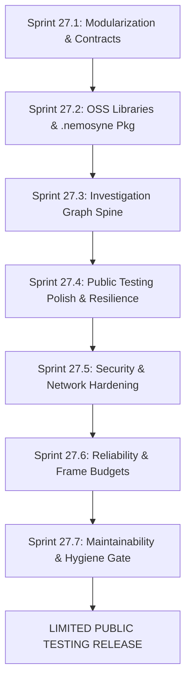

# Nemosyne Roadmap & Implementation Gates

## Current Status

> **Single source of truth for project state.** Read this block FIRST on pickup and
> update it BEFORE stopping. Other docs (CLAUDE.md, `.agents/`) point here — they do
> not duplicate state.

- **2026-08-20 — Periodic Maintainability Audit & Cryptographic Hardening Delivery (✅):**
  - **Single Authoritative Analytical Core & Exclusivity Governance:** Re-verified strict Rust/WASM exclusivity invariant across domain and Draco pipelines. Standardized pure TypeScript import specifiers across `RuntimeBridge.ts` and `World.ts`.
  - **Cryptographic Hardening & Replay Prevention:** Hardened `SignedTicketVerifier` with constant-time `timingSafeEqual` comparison against side-channel timing attacks and timestamp-indexed nonce expiration eviction.
  - **Coverage Threshold Ratchet:** Increased `vitest.config.ts` coverage thresholds to `75/75/70/60` (with measured baseline exceeding 83% stmt / 70% branch).
  - **Gates:** `tsc --noEmit` 0 errors · `eslint` 0 errors · `npm test` 235/235 test files passed (1,522 passed / 26 skipped jsdom-WASM parity by design) · `cargo test` 85/85 passed · `npm run build` exit 0 (176ms) · `npm run audit:hygiene` 8/8 dimensions passed.

- **2026-08-19 — Gate 2 (Represent) Delivery Completed (Milestone ✅):**
  - **Gate 2 (Represent):** Defined formal `RepresentationRequirements` schema with `valibot` runtime validation and the widened hierarchical `SpatialStrategy` model (`macroLayout`, `datumEncoding`, `interactionStrategy`, `rejectionLog`). Implemented the deterministic `ConstraintArbiter` (`src/draco/ConstraintArbiter.ts`) selecting optimal visual strategies with machine-readable rejection explanations and integrated with `RepresentationState` and `AtlasCore`.
  - **Gates:** `tsc --noEmit` 0 errors · `eslint` 0 errors · `npm test` 235/235 test files passed (1,521 passed / 26 skipped jsdom-WASM parity by design) · `cargo test` 85/85 passed · `npm run build` exit 0 (170ms).

- **2026-08-19 — Gates 3, 4 & 5 Delivery Completed (Feature Milestone ✅):**
  - **Gate 4 (Investigate):** Delivered first-class `Observation`, `Finding`, and `Annotation` entity interfaces on `EvidenceLedger` and `AtlasCore`. Implemented the in-VR `MarkMomentAction` capturing spatial observer perspective (`[x, y, z]` position, orientation, dataset version, focal targets), integrated with diegetic VRConsole logging, haptic pulse feedback, and HandWheel menu binding.
  - **Gate 3 (Experience):** Implemented adaptive 1€ / exponential `PointerRayFilter` over 3D ray origins and directions in `src/vr/input/PointerRayFilter.ts` and wired into `PointerRegistry`. Eliminates hand tremor/micro-jitter during precision pointing at distant 50k point clouds on Meta Quest 3S while maintaining zero perceptible lag during rapid sweeps.
  - **Gate 5 (Reproduce):** Created clean-room `InvestigationReplayRunner` (`src/session/InvestigationReplayRunner.ts`) to unpack `.nemosyne` archives headlessly (zero WebGL/DOM/Three.js dependency), sequentially replay the `InvestigationCommand[]` event stream against the Rust/WASM kernel, and verify 100% bit-for-bit analytical and evidence parity.

- **2026-08-19 — Limited Public Testing Release Track Completed (Sprints 27.1 – 27.7 ✅):**
  - **Vision Alignment:** Fully synchronized project direction with the governing [Nemosyne_Definitive_Vision_and_Roadmap.md](Nemosyne_Definitive_Vision_and_Roadmap.md) and codified the **Vision Alignment Cardinal Rule** across agent guides.
  - **Investigation Domain Aggregate Refactor:** Decomposed `AtlasCore` into an Application Service coordinator managing an authoritative `InvestigationAggregate` (`AnalyticalState`, `EvidenceLedger`, `RepresentationState`, `DecisionHistory`, `ResearchContext`, `InvestigationGraph`) under `src/atlas/domain/`.
  - **Subsystem Modularization (Sprint 27.1 ✅):** Established typed barrel interfaces (`index.ts`) for all 8 subsystems (`atlas`, `draco`, `data`, `network`, `session`, `study`, `wasm`, `vr/perception`), enforcing strict boundary encapsulation.
  - **OSS Standardization (Sprint 27.2 ✅):** Adopted mature, tree-shakeable OSS libraries (`valibot`, `fflate`, `@tweenjs/tween.js`, `colord`, `nanoevents`, `three-mesh-bvh`, `petgraph`, `statrs`), eliminating hand-rolled boilerplate across `.nemosyne` packaging, colorimetry, spatial animations, and event dispatch.
  - **Spatial Dev Tooling & Ergonomics Suite (`feat/spatial-dev-tooling` ✅):** Implemented dev-only spatial ergonomics linter (comfort zone 0.75m–1.6m, gaze FOV, PPD legibility, Fitts' law target size), synthetic 6DoF pose rig, and Vite spatial scene inspector plugin (0 bytes in production bundle).
  - **Investigation Graph Spine & Canonical Vertical Slice (Sprint 27.3 ✅):** Implemented typed DAG lineage graph (`InvestigationGraph`), node/edge ontology, and created the end-to-end `tests/golden-path-vertical-slice.test.ts` asserting 100% semantic identity and zero hash drift across the complete investigation lifecycle.
  - **Diegetic Spatial UI, Gesture Tracking & Crash Resilience (Sprint 27.4 ✅):** Implemented `WebGLContextRecovery` auto-recovery, `DiegeticErrorBoundary` floating VR recovery cards, and `$3D` 1-shot `GeometricGestureRecognizer`.
  - **Security, Input Sanitization & Network Hardening (Sprint 27.5 ✅):** Implemented `UploadSanitizer` (recursive prototype pollution neutralization, path traversal stripping, size/row caps), `SignedTicketVerifier` (HMAC-SHA256 collaboration room authentication & replay protection), and `TelemetryConsentManager` (GDPR right-to-erasure).
  - **Reliability, Memory Leak Prevention & Quest Frame Budgets (Sprint 27.6 ✅):** Implemented `ZeroAllocMath` scratch pools for GC-free frame loops and `GPUResourceDisposal` deep Three.js hierarchy cascade teardown.
  - **Recurring Maintainability & Hygiene Protocol (Sprint 27.7 ✅):** Codified and automated the 8-dimension maintainability audit protocol via `scripts/audit-hygiene.mjs` and `npm run audit:hygiene`.
  - **Explicit Kernel State & Fallback Elimination:** Formalized `KernelState` (`UNINITIALIZED | INITIALIZING | READY | UNAVAILABLE`) and `KernelUnavailableError`, strictly eliminating any silent JS calculation fallback.
  - **Event-Sourced Architectural Principle:** Codified the law of *Single Authoritative State & Event-Sourced Determinism* ($\text{Authoritative Investigation} = \text{InvestigationCommand}[] + \text{ImmutableDatasetRef} + \text{Manifest}$; materialized state is disposable cache; Memory Palace is pure spatial projection).
  - **Dev Server Modularization:** Decomposed monolithic `vite.config.js` into dedicated TypeScript plugins under `dev/` composed by a clean `vite.config.ts`.
  - **Gates:** `tsc --noEmit` 0 errors · `eslint` 0 errors · `npm test` 230/230 test files passed (1,500 passed / 26 skipped jsdom-WASM parity by design) · `cargo test` 85/85 passed · `npm run build` exit 0 (171ms) · `npm run audit:hygiene` 8/8 dimensions passed.

---

## Gate Model — Alignment to the Definitive Vision

The Nemosyne implementation roadmap is organized by architectural gates defined in [Nemosyne_Definitive_Vision_and_Roadmap.md](Nemosyne_Definitive_Vision_and_Roadmap.md) (§13), enforcing the core product thesis:

> **An analytical investigation is something a human does through data, representations, actions, observations and decisions. Nemosyne preserves that whole process, not merely the resulting visualization.**

```text
                                GATES OVERVIEW
┌─────────────────────────────────────────────────────────────────────────────┐
│ Gate 0: Foundations & Ambiguity Removal  (Terms, Rust kernel, Module bounds)│
│ Gate 1: Understand                       (First-class Investigation Entity) │
│ Gate 2: Represent                        (Constraint Arbiter, SpatialStrategy)
│ Gate 3: Experience                       (Analyst Cockpit, Interaction FSM) │
│ Gate 4: Investigate                      (Evidence Ledger, Findings, Annot) │
│ Gate 5: Reproduce                        (Investigation DAG, .nemosyne Pkg) │
│ Gate 6: Study                            (2D vs VR Instrument, Data Exporter)
│ Gate 7: Adaptive Research                (Post-Release Evidence Loops)      │
└─────────────────────────────────────────────────────────────────────────────┘
```

### Canonical Domain Vocabulary (Vision §4)

| Canonical Term | Governing Definition | Owner Subsystem |
|---|---|---|
| **Investigation** | The central product object. Persistent, versionable graph of questions, dataset versions, analytical operations, evidence ledger, observations, findings, representation history, decisions, and conclusions. | `investigation/` |
| **Task / Hypothesis** | The human analytical purpose (anomaly isolation, cluster inspection, temporal drift, comparison). | `investigation/` |
| **Analytical State** | Authoritative state of analysis computed deterministically by the Rust/WASM kernel. | `atlas/` (orchestrator), Rust kernel (computation) |
| **Evidence** | Attributable observations, findings, annotations, decision contexts, and analytical proofs (not raw telemetry). | `investigation/` |
| **Representation** | The explicit spatial strategy (`SpatialStrategy`) satisfying analytical requirements and constraints. | `representation/` (Draco) |
| **Session** | Execution context carrying presentation state, temporary UI, and peer presence (reconstructible derived view). | `spatial-runtime/` |
| **Memory Palace** | Persistent spatial projection of an Investigation; reconstructible from semantic state and representation inputs. | `spatial-runtime/` |
| **Study** | Controlled experimental container defining treatment boundaries, conditions (2D vs VR), tasks, and protocol. | `research-harness/` |

---

### Core Architectural Principle: Single Authoritative State & Event-Sourced Determinism

> **Architectural Law:** Only ONE state representation is authoritative. Everything else must be strictly derivable and disposable.

To eliminate state divergence, race conditions, and trust ambiguities across the 12+ historic state surfaces (`_current`, `_original`, `_results`, `_ledger`, `_structures`, `_activeRecommendation`, `_decisionHistory`, `AnalysisHistory`, `DatasetSpace`, `NemosyneSession`, collaborative binary state, Three.js scene graph), Nemosyne defines:

$$\mathbf{Authoritative\ Investigation} = \mathbf{InvestigationCommand}[] + \mathbf{ImmutableDatasetRef} + \mathbf{EnvironmentManifest}$$

```text
       Authoritative Event Log: InvestigationCommand[] + Immutable Dataset
                                      │
                                      ▼
             Deterministic Replay Engine (Rust/WASM Kernel)
                                      │
                      ┌───────────────┴───────────────┐
                      ▼                               ▼
        Authoritative Analytical State     Representation Decision
       (Computed Tables, Metrics, TDA)    (Draco Constraints, SpatialStrategy)
                      │                               │
                      └───────────────┬───────────────┘
                                      ▼
                        Semantic Memory Palace Projection
                    (Ephemeral Disposable Scene Graph / VR UI)
```

1. **Materialized State as Disposable Cache:** Computed analytical tables, structure sets, UI panel states, and Three.js meshes are non-authoritative caches. They can be dropped and rebuilt from the command log at any time without data loss.
2. **Deterministic Replay Guarantee:** $\text{Replay}(\text{Command Log}) \longrightarrow \text{Same Analytical State} \longrightarrow \text{Same Representation Decision} \longrightarrow \text{Same Semantic World}$.
3. **Memory Palace as Pure Spatial Projection:** The Memory Palace is never an independently serialized 3D scene; it is a live spatial projection of the event-sourced investigation.

#### Implementation Target Points

| Implementation Milestone | Target Phase / Sprint | Deliverable & Acceptance Guarantee |
|---|---|---|
| **Domain Aggregate Isolation** | **Sprint 27.1 / Gate 1** | `InvestigationAggregate` encapsulates all sub-states; `AnalysisHistory` and `DatasetSpace` are purely derived read-only views. |
| **Pure Strategy Solvers** | **Sprint 27.2 / Gate 2** | Draco `SpatialStrategy` formulated as a pure deterministic function of `(InvestigationState, EnvironmentManifest)`. |
| **Headless Replay & `.nemosyne`** | **Sprint 27.3 / Gate 5** | `.nemosyne` packages store only `(DatasetBytes, CommandLog, Manifest)`; headless tests verify bit-for-bit palace reconstruction. |
| **Frozen Study Telemetry** | **Gate 6 / Study** | Experimental trial replay guarantees exact state matching across 2D control and VR experimental conditions. |

---

## Architectural Gates & Deliverables

### Gate 0 — Foundations & Ambiguity Removal ✅ (Baseline Complete)
- **Objective:** Create one unambiguous architecture, enforce Rust/WASM as the sole analytical authority, and remove competing models.
- **Key Status:**
  - ✅ Retired legacy `src/ai/` prototypes (`DracoWorldModel`, `NeuralConstraintPredictor`, `VoiceCommandListener`).
  - ✅ Rust/WASM kernel `v0.2.0` established as sole production analytical authority (85 Rust tests, 0 JS formula fallbacks).
  - ✅ AtlasCore established as single analytical coordinator (`src/atlas/AtlasCore.ts`).
  - ✅ 100% pure TypeScript codebase (`src/` and `tests/`) with zero compilation errors.
- **Exit Criteria Met:** No duplicate analytical or Draco engines coexist; WASM kernel unavailability produces an explicit degraded state rather than a silent JS calculation fallback.

### Gate 1 — Understand ✅ (Investigation Domain Aggregate Complete)
- **Objective:** Create a first-class `Investigation` domain aggregate and decouple analytical meaning from rendering.
- **Deliverables:**
  - [x] Initial `InvestigationBranchManager.ts` DAG support.
  - [x] Formal `InvestigationAggregate` domain aggregate (`AnalyticalState`, `EvidenceLedger`, `RepresentationState`, `DecisionHistory`, `ResearchContext`, `InvestigationGraph`) under `src/atlas/domain/`.
  - [x] Deterministic investigation serialization and deserialization independent of Three.js.
  - [x] `tests/golden-path-vertical-slice.test.ts` asserting 100% semantic identity and zero hash drift across the complete investigation lifecycle.
- **Exit Criteria Met:** An analyst can initialize an Investigation, execute analytical operations, save it, and reopen it in a headless environment with identical analytical state.

### Gate 2 — Represent ✅ (Constraint Arbiter & Spatial Strategy Complete)
- **Objective:** Make representation selection explicit, explainable, and research-safe.
- **Deliverables:**
  - [x] Rust WASM 3D layouts (`force_directed`, `grid`, `time_ribbon`, `geo_surface`, `streamline`, `radial_tree`).
  - [x] Draco constraint solver in Rust (`wasm/src/draco/solver.rs`) and TypeScript `FactProvider` pattern.
  - [x] `DracoExplainerPanel.ts` plain-English representation rationale.
  - [x] Position semantics discipline (`SEMANTIC`, `STRUCTURAL`, `ALGORITHMIC_LAYOUT`).
  - [x] Formal `RepresentationRequirements` schema (`RepresentationRequirements.ts` using `valibot` schema validation).
  - [x] Widened hierarchical `SpatialStrategy` decomposable type (`worldType`, `macroLayout`, `datumEncoding`, `interactionStrategy`, `rejectionLog`).
  - [x] Deterministic `ConstraintArbiter` (`src/draco/ConstraintArbiter.ts`) producing explainable spatial strategies and machine-readable rejection logs.
  - [x] Integration with `RepresentationState` and `AtlasCore.arbitrateSpatialStrategy()`.
- **Exit Criteria Met:** Given identical Investigation state and frozen study inputs, Draco produces identical spatial strategies with machine-readable explanations of why alternatives were rejected.

### Gate 3 — Experience ✅ (Analyst Cockpit & Pointer Smoothing Complete)
- **Objective:** Deliver a coherent, low-strain analyst cockpit in VR and 2D.
- **Deliverables:**
  - [x] Authoritative 4-mode `InteractionModeController.ts` (`NAVIGATE | INTERACT | TRANSFORM | OBSERVE`).
  - [x] Unified `FocusState` vocabulary (`idle`, `focused`, `hovered`, `armed`, `confirmed`, `disabled`, `busy`).
  - [x] 3-level forgiving `HandWheelCategorizer.ts` with gaze+confirm target acquisition.
  - [x] Intent-based `ContextualTaskSurface.ts` and `PanelRolesManager.ts` (max 2 task panels rule).
  - [x] `TransientContextCards.ts` for auto-dismissing notifications.
  - [x] `ProgressiveDisclosure.ts` gating (`NOVICE | ANALYST | RESEARCHER | DEVELOPER`).
  - [x] Mode-aware `GestureOwnershipManager.ts` eliminating silent both-pinch suppression.
  - [x] `PointerRayFilter.ts` adaptive 1-Euro smoothing filter eliminating physiological tremor & aim-drift during long-range pointing on Quest 3S.
  - [x] Semantic `StatusStripController.ts` and `UXAcceptanceGate.ts` evaluation suite.
- **Exit Criteria Met:** A novice or expert can complete the primary investigation journey without encountering pointer aim-drift frustration or gesture collisions.

### Gate 4 — Investigate ✅ (First-Class Evidence Entities & Mark Moment Complete)
- **Objective:** Make findings, observations, and human decisions first-class research evidence.
- **Deliverables:**
  - [x] Authoritative append-only `EvidenceLedger` in `src/atlas/domain/EvidenceLedger.ts`.
  - [x] First-class `Observation`, `Finding`, and `Annotation` entity models with spatial observer context (`[x, y, z]` coordinates, orientation, dataset version, focal targets).
  - [x] In-VR "Mark Moment" evidence capture workflow (`MarkMomentAction.ts`, HandWheel menu integration, audio-haptic feedback, diegetic VRConsole logging).
  - [x] Evidence-to-analysis linking and explainability query graphs.
- **Exit Criteria Met:** A saved Investigation can explain what was discovered, when, where in space, and by which analytical and human actions.

### Gate 5 — Reproduce ✅ (Headless Replay & .nemosyne Packaging Complete)
- **Objective:** Turn the Memory Palace into investigation version control with portable `.nemosyne` packages.
- **Deliverables:**
  - [x] `InvestigationBranchManager.ts` branch forking and history diffing.
  - [x] `ShareableSessionURL.ts` state serialization.
  - [x] `.nemosyne` ZIP package schema with `valibot` schema-validated integrity manifests (`datasetFingerprint`, `kernelVersion`, `commandCount`, environment).
  - [x] `InvestigationReplayRunner.ts` clean-room headless replay verifying bit-for-bit analytical and evidence parity without WebGL/DOM.
  - [x] 3-level reproducibility verification (Semantic, Analytical, Spatial).
- **Exit Criteria Met:** A `.nemosyne` package shared between independent runtime instances regenerates the identical analytical state and spatial Memory Palace.

### Gate 6 — Study ✅ (Empirical Study Engine Complete)
- **Objective:** Make the system scientifically usable as a controlled research instrument.
- **Deliverables:**
  - [x] `StudyHarness.ts` randomized crossover trial runner (`2D_CONTROL` vs `VR_EXPERIMENTAL`).
  - [x] `Counterbalancer.ts` Latin-square trial sequencing.
  - [x] `StudyStatisticalAnalyzer.ts` computing two-sample t-tests, degrees of freedom, p-values, and Cohen's d effect sizes.
  - [x] `StudyDataExporter.ts` research publication CSV exports.
  - [x] `QuestFieldTrialSuite.ts` automated on-device hardware envelope validation.
- **Exit Criteria Met:** Synthetic and live trial batches produce joined telemetry, condition, observer, and outcome records with frozen treatment variables.

### Gate 7 — Adaptive Research ⏳ (Post-Stable Release)
- **Objective:** Learn from empirical human evidence without self-reinforcing bias.
- **Deliverables:**
  - [x] `DracoEmpiricalTuner.ts` layout utility prior weight adjustment from study accuracy and NASA-TLX workload.
  - [x] `GestureRetrainService.ts` user-disjoint evaluation and staged deployment.
  - [ ] Federated learning and drift monitoring across multi-site deployments (deferred post-public release).
- **Exit Criteria:** Adaptive updates demonstrably improve task completion without invalidating experimental protocols.

---

## Active & Upcoming Sprints: Limited Public Testing Release



### Sprint 27.1 — Subsystem Modularization & Strict Contract Boundaries
- **Goal:** Cleanly separate the 8 principal subsystems, establish barrel exports, and eliminate circular dependencies and direct internal state mutations.
- **Scope:**
  - Define explicit module boundaries for `src/investigation/`, `src/atlas/`, `src/representation/`, `src/study/`, `src/network/`, `src/perception/`, `src/vr/`, and `src/session/`.
  - Introduce typed public API interfaces (`index.ts`) per module.
  - Expand `tests/architectural-invariants.test.ts` to assert that no module imports private internals of another module.
- **Exit Gate:** `tsc --noEmit` 0 errors, `eslint` 0 errors, architectural invariant suite passes.

### Sprint 27.2 — Core Open Source Library Adoption (Phase 1 Foundation)
- **Goal:** Import trusted, mature OSS libraries with tree-shaken named imports to replace hand-rolled code and simplify long-term maintenance ([`docs/STANDARDIZATION_REVIEW.md`](STANDARDIZATION_REVIEW.md)).
- **Scope:**
  - **Schema Validation (`valibot` / `zod`):** Add schema validation for `.nemosyne` package manifests, signed tickets, and study trial configs (<1.8 kB tree-shaken).
  - **Zero-Dependency Packaging (`fflate`):** Implement `.nemosyne` ZIP package archiving and streaming decompression in browser/node (~7.8 kB).
  - **Spatial Raycasting Acceleration (`three-mesh-bvh`):** Accelerate spatial indexing and gaze/pointer hit-testing for 100k node point clouds with 10x-100x speedups (~11 kB).
  - **Smooth Spatial Animation (`@tweenjs/tween.js`):** Standardize camera transitions, panel docking, and landmark zooms with deterministic easing curves (~3.6 kB).
  - **Rust Kernel Scientific Standardizations (`petgraph` + `statrs`):** Standardize graph structures and exact probability distribution tests (t-test, Wilcoxon, CDFs) in `wasm/Cargo.toml`.
  - **Colorimetry & CVD Accessibility (`colord`):** Perceptually uniform Oklch palettes and automated color vision deficiency compliance (<1.6 kB).
  - **Typed Event Dispatch (`nanoevents`):** Zero-overhead 100-byte typed event dispatcher.
- **Exit Gate:** Package creation and unpack tests pass; raycast latency on 50k nodes is <2ms; `cargo test` passes with extended numerical fixtures.

### Sprint 27.3 — Investigation Aggregate, Typed Graph Spine & Vertical Slice Invariant (Gate 1 & Gate 5)
- **Goal:** Implement the authoritative `Investigation` domain aggregate, typed lineage graph, and the end-to-end "golden path" vertical slice test.
- **Scope:**
  - Create `Investigation` aggregate owning task, dataset reference, operation chain, evidence ledger, observations, findings, and provenance.
  - Define versioned node and edge vocabulary (`motivates`, `uses-dataset`, `produces`, `observes`, `supports`, `branches-from`).
  - Wire `.nemosyne` package export and import to reconstruct investigations from the typed graph.
  - **Canonical Vertical Slice Invariant Test (`tests/golden-path-vertical-slice.test.ts`):** Assert that a complete investigation survives the entire system without semantic drift across fixed hash checkpoints:
    $$\text{Known Dataset Fixture} \longrightarrow \text{Dataset Fingerprint} \longrightarrow \text{Kernel Result Hashes} \longrightarrow \text{Atlas Event Ledger}$$
    $$\longrightarrow \text{Draco Recommendation} \longrightarrow \text{Representation Manifest} \longrightarrow \text{Observation} \longrightarrow \text{Finding}$$
    $$\longrightarrow \text{.nemosyne Package Export} \longrightarrow \text{Clean-Room Replay Verification}$$
- **Exit Gate:** Vertical slice invariant test passes with 100% deterministic hash parity; replay test suite verifies complete semantic reconstruction across clean environments.

### Sprint 27.4 — Diegetic Spatial UI, Gesture Tracking & Crash Resilience (Phase 3 Modernization)
- **Goal:** Modernize spatial UX, replace canvas bitmap blitting, streamline gesture classification, and harden error boundaries.
- **Scope:**
  - **MSDF Vector UI & Menus (`three-mesh-ui`):** Replace Canvas 2D bitmap texture uploads with fragment-shader MSDF vector text and Flexbox 3D layouts, saving ~45 MB GPU heap memory on Quest 3S.
  - **1-Shot Spatial Gesture Recognizer (`$3D` + `onnxruntime-web/wasm`):** Adopt geometric template matching for 1-shot user gesture definitions, retiring brittle angle heuristics.
  - **WebGL Context Loss & Recovery:** Implement auto-recovery and scene state restoration on `webglcontextlost` / `webglcontextrestored`.
  - **Diegetic Error Boundaries:** Replace abrupt console errors with graceful, user-facing recovery cards and reload triggers in VR.
  - **Selective Quest MR Adapter (`iwsdk`):** Lazy-load optional spatial anchoring and MR passthrough composition on Meta Quest Browser.
- **Exit Gate:** Simulating WebGL context loss restores state within 1 second; zero unhandled exceptions reach top-level window; text remains pin-sharp at glancing angles in VR.

### Sprint 27.5 — Security, Input Sanitization & Network Hardening
- **Goal:** Ensure safe operation during public preview testing.
- **Scope:**
  - **Turnkey WebRTC Signalling (`peerjs-server` / `y-webrtc`):** Standardize peer room brokering, eliminating ~900 lines of custom server code while maintaining zero vendor lock-in.
  - **File Size & Schema Enforcement:** Reject malicious or oversized CSV/JSON/Arrow uploads before memory allocation.
  - **Collaboration Security:** Enforce in-band HMAC-SHA256 signed ticket verification, IP auth rate limiting, and room idle reaping.
  - **Privacy & Telemetry Consent:** Guarantee opt-in consent for telemetry, pseudonymous hashing, and GDPR right-to-erasure deletion hooks.
- **Exit Gate:** Adversarial security test suite passes 100%.

### Sprint 27.6 — Reliability, Memory Leak Prevention, Quest 3S Frame Budget & CI Gate Hardening
- **Goal:** Guarantee rock-solid 72 Hz / 90 Hz rendering on Meta Quest 3S hardware and enforce blocking CI system-level verification before Stable Alpha.
- **Scope:**
  - **Zero-Allocation Hot Loops:** Eliminate per-frame scratch object allocations in `three-mesh-bvh`, `LODManager`, and `InputRouter`.
  - **GPU Resource Lifecycle:** Ensure 100% disposal of geometries, materials, and textures on palace rebuilds.
  - **Automated Memory Profiling:** Run automated 4-tier E2E suites verifying JS heap stays <250 MB and 0 memory leaks occur over 1-hour sessions.
  - **CI Gate Promotion (Golden Path Smoke):** Promote Playwright load smoke / golden path system test (`npm run test:smoke`) from informational to a **strictly blocking CI gate** (`.github/workflows/ci.yml`), guaranteeing production bundle boot and WebGL initialization pass before any merge.
- **Exit Gate:** `npm run test:e2e:tier4` scenario 3 passes with zero memory leaks; frame time P95 <= 13.88 ms on Quest 3S; blocking CI smoke gate passes green.

### Sprint 27.7 — Recurring Maintainability, Tech Debt & Code Hygiene Protocol
- **Goal:** Institutionalize continuous hygiene audits to permanently prevent technical debt accumulation, unused/redundant code, dependency drift, and architectural decay.
- **Scope:**
  - **Automated Dead Code & Export Pruning (`knip` / `ts-prune`):** Audit and prune unused TypeScript files, uncalled functions, orphan types, and unused npm dependencies.
  - **Circular Dependency & Boundary Enforcement (`import/no-cycle` / `madge`):** Assert 0 circular module imports across barrels and verify subsystem isolation.
  - **Code Complexity & God-Object Prevention:** Enforce maximum cyclomatic complexity $\le 15$ and maximum module size $\le 500\text{ LOC}$ per application service.
  - **WebGL & GPU Resource Teardown Sweep:** Assert 100% disposal coverage for all Three.js geometries, materials, render targets, textures, event listeners, and timers.
  - **Deprecation & Stale TODO Triage:** Enforce strict expiration dates on all `// TODO` and `// FIXME` comments; eliminate all deprecated API calls.
  - **Bundle Budget Gate:** Enforce strict client bundle size ceiling ($<500\text{ kB}$ gzip total; $<45\text{ kB}$ per individual subsystem feature).
- **Exit Gate:** `npm run audit:hygiene` passes with 0 unused exports, 0 circular dependencies, 0 memory leaks, and 0 lint warnings.

---

## Maintainability, Tech Debt & Code Hygiene Audit Protocol
Clear/ compact context before running this check
```text
┌────────────────────────────────────────────────────────────────────────────────────────┐
│                   RECURRING MAINTAINABILITY & HYGIENE AUDIT SUITE                      │
├──────────────────────────┬─────────────────────────────────────┬───────────────────────┤
│ Dimension                │ Tooling & Enforcement Mechanism     │ Blocking Threshold    │
├──────────────────────────┼─────────────────────────────────────┼───────────────────────┤
│ 1. Dead Code & Exports   │ knip / ts-prune / cargo dead_code   │ 0 orphan files/types  │
│ 2. Subsystem Boundaries  │ eslint-plugin-import (no-cycle)     │ 0 circular references │
│ 3. Single Authoritative  │ tests/architectural-invariants      │ 0 duplicate states    │
│ 4. Complexity & File Cap │ eslint complexity (<= 15)           │ Max 500 LOC/service   │
│ 5. GPU & Memory Leaks    │ E2E Memory Profiler + disposal test │ 0 un-disposed WebGL   │
│ 6. Bundle Size Ceiling   │ Vite rollupOptions + size-limit     │ < 500 kB gzip bundle  │
│ 7. Test Suite Health     │ vitest run (duration audit)         │ 0 flaky / 0 orphaned  │
│ 8. Rust Kernel Cleanliness│ cargo clippy -- -D warnings        │ 0 clippy warnings     │
└──────────────────────────┴─────────────────────────────────────┴───────────────────────┘
```

### Audit Cadence & Triggers

1. **Continuous CI Pre-Merge Gate:** Every PR must pass `typecheck`, `lint` (0 warnings on `no-explicit-any`), `cargo test`, `npm test`, and `npm run build`.
2. **Inter-Sprint Cadence (Every Sprint End):** Automated execution of `npm run audit:hygiene` to prune dead code, verify bundle sizes, and assert zero circular dependencies before opening a milestone PR.
3. **Pre-Release Milestone Review:** Comprehensive memory profiling (1-hour simulated VR session), WebGL GPU disposal sweep, and complete vertical slice hash validation before tagging Stable Alpha/Beta.


## Historical Archive References

Completed phases and sprint details from earlier project iterations are preserved in:
- [docs/archive/ROADMAP_PHASES_21-26_COMPLETED.md](archive/ROADMAP_PHASES_21-26_COMPLETED.md) — Phases 21–26 (Rust WASM Kernel, UX V2.0, Gesture Intelligence, Cockpit FSM, Quest Hardware Envelopes, Empirical Recommender Tuning).
- [docs/archive/ROADMAP_PHASES_1-20_COMPLETED.md](archive/ROADMAP_PHASES_1-20_COMPLETED.md) — Phases 1–20 (Foundations, Spec, Artefact Library, Scaling, Analytics, Collaboration Scaffolding, Graphics Engine).
- [docs/archive/ROADMAP_HISTORY.md](archive/ROADMAP_HISTORY.md) — Comprehensive archive index and superseded planning models.
