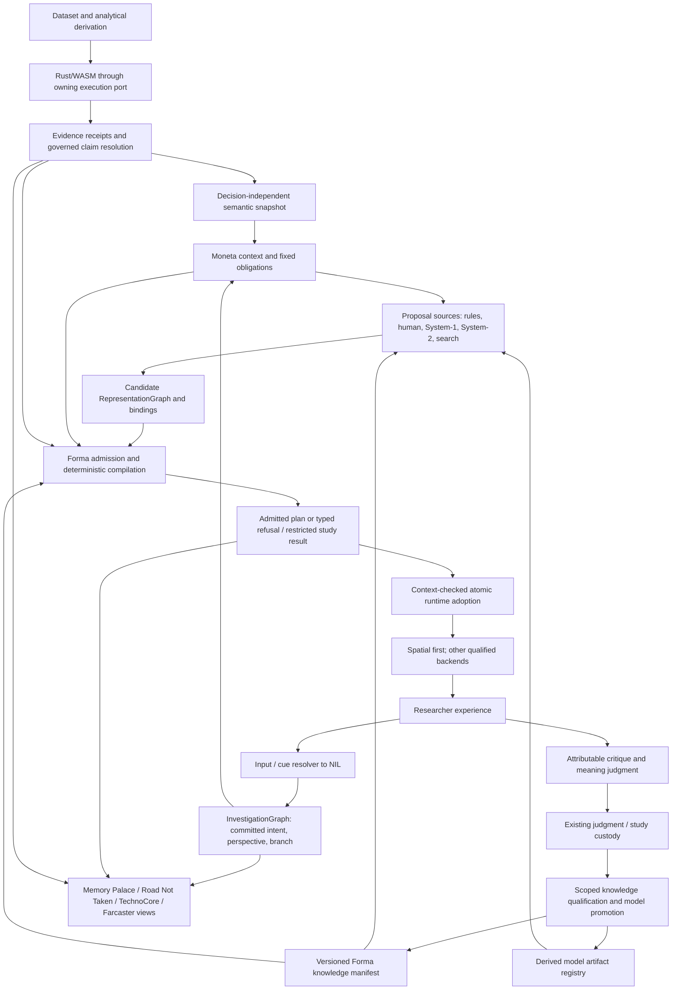

# ERA-ASTRA1 — Architecture 2027 adjudication

**Date:** 3 October 2026
**Disposition:** CHANGE before L2-FORMA-0 freezes durable contracts; retain the Full-Moneta destination.
**Scope:** architecture review and recommended implementation boundaries only. No production implementation, cleanup, gate relaxation or capability promotion.
**Authority:** this is the ERA-ASTRA1 decision artifact, subordinate to the [Definitive Vision](../Nemosyne_Definitive_Vision_and_Roadmap.md). [ROADMAP.md](../ROADMAP.md) remains execution/status authority. Recommendations that cross the [RFC threshold](../RFC_PROCESS.md) are not accepted RFCs merely because they appear here.

## 1. Judgment

The human-grounded Full-Moneta proposal in [PR #912](https://github.com/TsatsuAmable/nemosyne/pull/912) can support the requested capabilities **if its authority and identity contracts are tightened before implementation**. Its broad separation of analytical evidence, representation, perceptual compilation, interaction and human learning is worth keeping. Its boxes and proposed record names are not yet a minimal, implementable architecture.

The expensive decisions are these:

1. A semantic snapshot is an evidence-bound projection, not another source of analytical truth, and its identity must not depend on the representation decision that consumes it.
2. Investigation owns committed intent/perspective and branch lineage. Moneta owns representation proposals and task obligations. The compiler may satisfy or refuse those obligations, never weaken them to make a candidate fit.
3. One Forma admission/compilation entry point delegates scientific decisions to existing evidence authorities. System-2 is not a second admission authority, and System-1 is not a mandatory intermediate step.
4. One versioned Forma knowledge **view** is useful; one mutable authority for rules, judgments, studies and qualification is not. Retain independent owners and expose a pinned, typed manifest for retrieval/compilation.
5. Mechanical obligation coverage and human recovery of meaning are different claims. The stickman/Mona-Lisa invariant needs both; a structurally valid plan cannot certify comprehension.
6. Qualification must be scoped by claim and execution purpose. Controlled study execution of an unqualified mapping must not become production promotion. Otherwise the human-grounding loop either deadlocks or bypasses evidence governance.
7. Persist exact plan/binding, admission and context lineage when the first researcher-visible Forma slice lands. Explanation and non-adaptive judgment capture belong in that slice, not after a generic behavior engine.

**Do not begin L2-FORMA-0 by freezing all thirteen proposed types as independent persistent objects.** Resolve the identity/version decision and admit one static, evidence-bound spatial slice first. Keep behavior, additional modalities, learning and search behind that same boundary.

## 2. Specimen, working-tree evidence and limits

### 2.1 Exact starting state

The requested machine-local `main` checkout was inspected in place, before any review edits:

| Item | Observed state |
| --- | --- |
| Local main path | `/Users/tsatsuamable/Documents/nemosyne` |
| Local main HEAD | `58071e49c4707a21ce72cd9a87018d85d093f364` |
| Complete initial porcelain status | `A  docs/review-plans/MAC_PRE_ASTRA_CONVERGENCE_2026-10-03.md` |
| Other staged, unstaged or untracked files there | None reported by `git status --porcelain=v1 --untracked-files=all` |
| Convergence-report Git blob identity | `0287b31f8f6d815145286a2a49ab939f5dceeb30` |
| Convergence-report SHA-256 | `9330c35ef34165884af0ee431fff74cdcaaedef4c5d0df8721db6b115a1e5e4d` |
| Initial task checkout | `/Users/tsatsuamable/.codex/worktrees/6832/nemosyne`, clean, detached at `d7388e2dc2946225f974fffb12ed7ef3c5759ef9` |
| Live remote-main observation | `git ls-remote origin refs/heads/main` returned `d7388e2dc2946225f974fffb12ed7ef3c5759ef9` |

The primary review specimen is local main plus the staged Gemini-produced convergence report. The report was read as input evidence, not committed fact or an instruction to delete worktrees/stashes. It remains untouched in its original checkout. Its “100% clean”, “zero uncommitted” and synchronized-main assertions do not describe the state observed here. Its “0 contradictions” conclusion is not a substitute for this adjudication. This does not establish that those statements were false when the earlier audit ran.

Remote main was four commits ahead: #916's roadmap snapshot and #917's live-ingest non-record-row refusal. `git diff 58071e49..d7388e2` affects only `docs/ROADMAP.md`, `src/data/connectors/normalize.ts` and `tests/live-rows-shape-validation.test.ts`. None changes the reviewed Forma/semantic contracts. The output branch, `codex/era-astra1-architecture-2027`, was created from exact local main and fast-forwarded to this checked remote head for delivery. Local main and its index were not switched, reset or overwritten.

No active host leases or open GitHub PRs were returned at intake. The output worktree was exclusively claimed through `nemosyne-workstream` for this report only; shared roadmap/schema files are outside that claim. This is a local coordination observation, not proof that no other machine is working.

### 2.2 Prior review artifacts and reconciliation

Filename and content searches of the local main documentation found **no delivered ERA-AG1 or ERA-AG2 review artifact**. ROADMAP defines their requested outputs, and the CMS7 census refers work to them; neither is an AG1/AG2 result. There is consequently no AG1/AG2 disagreement to adjudicate, and no invented consensus. A later AG review should challenge the decisions below, not restart this review by default.

Other architecture/review inputs inspected include:

| Input | Use in this review |
| --- | --- |
| `docs/review-plans/MAC_PRE_ASTRA_CONVERGENCE_2026-10-03.md` (staged, identity above) | Intake/provenance and retained Quest evidence leads. Accept readiness to review, not global architectural closure. |
| [Full-Moneta proposal](FULL_MONETA_SEMANTIC_EMBODIMENT_ARCHITECTURE_PLAN.md), [MCR plan](../roadmap/P1_MCR_COMPOSITIONAL_REPRESENTATION_EXPANSION.md), [MCR0 schema decision](MONETA_MCR0_AUTHORITY_SCHEMA.md) | Proposals and existing compatibility obligations; MCR0's V1 extension decision does not authorize a later semantic reinterpretation. |
| [Current architecture](../ARCHITECTURE.md), [dataset-first architecture](MONETA_DATASET_FIRST_SEMANTIC_EMBODIMENT.md), [dataset-first audit](../audits/MONETA_DATASET_FIRST_SEMANTIC_EMBODIMENT_AUDIT_2026-09-18.md) | Separate existing family payloads from the proposed general graph/compiler. Historical fallback findings are leads, not automatically current defects. |
| [System-1/System-2 plan](MONETA_SYSTEM1_SYSTEM2_ONNX_ARCHITECTURE.md), [capability ladder](../roadmap/P1_FULL_MONETA_INCREMENTAL_CAPABILITY_PLAN.md) | Preserve advisory models, explicit STOP points and vertical product increments. |
| [Evidence protocol](../research/MONETA_EVIDENCE_PROTOCOL.md), [lab authority cleavage audit](../review-plans/LAB_AUTHORITY_CLEAVAGE_AUDIT_2026-09-19.md), RFC 0007/0009 and ADR 0007/0008 | Claim-bound admission, production/lab separation, receipt/persistence authority. Earlier dated status prose is subordinate to current source and ROADMAP. |
| [ADR 0009](decisions/0009-ap-inv-fm1-question-aware-investigation.md) | InvestigationGraph owns lineage; preserve stable node IDs and legacy digests. Intent contract existence is not full FM1 integration. |
| [RF062A](../review-plans/RF062A_WORLD_BOUNDARY_CONTRACT_2026-08-29.md), [RF062C](../review-plans/RF062C_DATASET_REPRESENTATION_BOUNDARY_2026-08-29.md) | Preserve composition-root direction and load-versus-surface ownership. No file-size-driven splitting. |
| [CMS5 palette decision](../review-plans/CMS5_PALETTE_CVD_DECISION_2026-10-02.md), [CMS6 perception audit](../review-plans/CMS6_MULTIMODAL_PERCEPTION_AUDIT_2026-10-02.md), [FM3 spatial-audio audit](../review-plans/FM3_PERCEPT_SPATIAL_AUDIO_AUDIT_2026-10-03.md), CMS7 census | Do not inherit unsupported perceptual claims or revive retired prototypes as Forma backends. Operational feedback is distinct from data-bearing sound/haptics. |
| [UX doctrine](../NEMOSYNE_USER_EXPERIENCE_DESIGN_DOCTRINE.md), [spatial flow specification](../Nemosyne_UX_Flow_and_Spatial_Interface_Design_Spec.md) | Meaning before richness; explicit preview/return, disposable projections, stable frames, NIL parity. A Farcaster is context travel, not an arbitrary operation button. |

This is a source-backed architectural adjudication, not a repository-wide defect audit, performance measurement, human study or certification of all existing execution paths. No external model/provider superiority is claimed. The external laboratory's current genome contract was not inspected; only the repository's documented handoff was evaluated. Proposed falsifiers below are future acceptance requirements unless explicitly reported as executed.

## 3. Intended versus actual topology

Source anchors in this section are relative to local main `58071e49`; the checked delivery-base drift does not change them.

| Actual boundary | Source evidence | Architectural consequence |
| --- | --- | --- |
| Analytical execution is runtime-owned | `src/atlas/ports/AnalyticalExecutionPort.ts:4` declares semantic/analytical operations; `src/atlas/MonetaEvidenceAuthority.ts:28` requires injected runtime authority. `src/wasm/runtime/SemanticEmbodimentBridge.ts:25` invokes prepared Rust family results; builders live under `wasm/src/moneta/`. | KEEP the injected port and runtime-local handles. Normalization must consume authoritative outputs, not reacquire a module singleton or scan rows. |
| Evidence-backed arbitration exists | `src/moneta/representation/EvidenceBackedMoneta.ts:36` validates the supplied signature against evidence; `:68` reconstructs authoritative signature input. | Reuse this direction; it does not prove arbitrary future bindings have claim-complete receipt coverage. |
| Governed receipt consumption is narrower than Full Moneta | `src/data/evidence/ConsumerPolicyRegistry.ts:35` registers the descriptive-statistics consumer; `src/session/InvestigationReplayRunner.ts:561` begins governed receipt handling. | A working V3 replay seam is not evidence that every semantic family or composed claim is governed. L0 must qualify each newly consumed claim/profile. |
| Semantic graph is currently decision-coupled | `SemanticEmbodimentGraphV1.ts:35` requires `decisionId`; nodes carry string evidence refs and optional presentation hints. | The proposed upstream semantic-world role needs a versioned decision-independent identity. Keep V1 as a legacy projection, not silently changed truth. |
| Schema supports composition; execution remains compatibility-oriented | `RepresentationGraphAdapter.ts` produces compatibility graphs; `MonetaTopologyNode.ts:175` calls `RepresentationGraphRuntimeAdapter.ts:104`; its `:71` path refuses anything other than one renderable primitive. | Preserve the refusal until explicit multi-element runtime adoption. Graph existence does not mean FM3 is shipped. |
| MCR1 validation is a contract seam, not production-wide admission | `ComposedRepresentationValidation.ts:72–90` permits unresolved IDs on compatibility graphs; `:47` compares evidence strings; `:136` uses that overlap for relation validation. Source search finds no production call to `validateComposedRepresentation` outside its definition. | Do not install this validator unchanged as the Forma trust boundary. A caller-controlled provenance string is not admission authority; shared evidence is not proof of comparability. This is a demonstrated topology limitation, not a demonstrated exploitable product bypass. |
| Backend plans are locally validated records | `SpatialEmbodimentPlanV1.ts:30` checks element shape/bounds, not complete evidence or cross-plan authority. | Parsing succeeds before admission; runtime must not treat a parsed plan as approved. |
| Intent and human feedback foundations already exist | `src/atlas/domain/InvestigationIntent.ts:5` provides canonical intent; `src/judgement/RepresentationJudgement.ts:10` distinguishes preference/rating/rejection/outcome links; `JudgementLedger.ts:25` describes append-only attribution. | Extend these owners for perspective and meaning evidence. Do not introduce a parallel human-judgment database under Forma. |
| Product metaphors already have projection wiring | `src/vr/presentation/epistemic/FunctionalWorldObjectsPresenter.ts:40` explicitly projects Atlas; `:99` updates Memory Palace and `:214` supplies its source. | Extend that path. The separate `src/memory/MemoryPalaceGraph.ts` authoring structure is not permission to establish a second investigation DAG. |
| Learning and inference are bounded but not a Forma knowledge system | `LearnedMonetaRuntime.ts:36` still derives compatibility geometry from layouts; `src/moneta/system1/System1InferencePort.ts` supplies a provider-neutral inference envelope. `src/fitness/PromotionGate.ts:63` separates eligibility from activation. | Reuse ranking/model provenance, migrate outputs to proposals, and retain separate promotion. Do not treat the prototype port as a qualified production Forma model. |
| Residency is not semantic-resolution authority | `src/vr/scalability/SemanticMaterialisationGovernor.ts:3` carries runtime/dataset/decision identity and coarse/refined resource state; `src/vr/presentation/representation/RepresentationSurface.ts:131` owns replacement. | Extend these owners for admitted variants and atomic adoption, not a competing resource governor. |
| Study freeze is useful but incomplete for Forma | `src/study/StudyFreezeManifest.ts:13` pins current treatment/runtime versions. | Add plan, knowledge, binding, compiler, perspective and adaptation identities before making Forma treatment claims. Existing freeze metadata does not already cover them. |

The real migration is from **decision-first family selection with bounded Rust payloads** to **evidence-bound semantic projection plus compositional proposal and admitted compilation**. It is not insertion of a new box into an already-complete pipeline. Family builders and semantic detail remain valuable; their current request/decision coupling must be adapted deliberately.

## 4. KEEP / CHANGE / INVESTIGATE decisions

| ID | Decision | Recommendation and rejected alternative |
| --- | --- | --- |
| A1 | **KEEP** | Rust/WASM owns analytical results, N-dependent work, topology/membership and data-derived geometry. TS may validate compact contracts and compile symbolic perceptual mappings. Reject both a TS analytical normalizer and a wholesale move of representation reasoning into Rust. |
| A2 | **CHANGE** | Normalize a decision-independent semantic snapshot from family outputs and evidence. Preserve family payloads as typed leaves, including missing/refused/approximate state. Reject a universal lowest-common-denominator graph that drops measurement, support or limitations. |
| A3 | **KEEP / CHANGE** | Keep intent and perspective distinct: question/task versus foreground/comparison frame. Store perspective within committed Investigation context rather than a separate mutable perspective service. Reject perspective as a second dataset/evidence namespace. |
| A4 | **KEEP / CHANGE** | Keep RepresentationGraph for composition and coordination. Move authoritative data-bearing encodings to typed bindings; derive legacy `visualEncoding` only at the compatibility edge. Reject independently editable graph encodings and Forma mappings for the same property. |
| A5 | **CHANGE** | Moneta derives task obligations before candidate comparison under pinned policy; Forma evaluates satisfaction. Reject candidate-authored weakening of `MUST_PRESERVE`. Obligations belong to the decision context, with references in plans. |
| A6 | **KEEP / CHANGE** | Keep deterministic Forma, but split shape checking, claim resolution, compilation and live adoption conceptually under one entry point. Reject System-2, Forma and the runtime each maintaining their own scientific gate. |
| A7 | **CHANGE** | Use one knowledge snapshot/interface over typed records with separate write/promotion authorities. Reject a monolithic KB containing mutable authoritative copies of human judgments and study results; also reject microservices for every record kind. |
| A8 | **KEEP / CHANGE** | Keep critique separate from judgment in meaning and state transitions; implement them as distinct typed records within existing investigation/judgment ownership. An LLM draft is not a human confirmation; a critique's successful compilation is not successful comprehension. |
| A9 | **KEEP** | System-1 is a derived, replaceable retrieval/ranking model over durable knowledge. A deterministic baseline remains usable without it. Separate physical-input cues from Forma proposal tasks. |
| A10 | **KEEP / CHANGE** | System-2 is the right location for explicit novel analogy/synthesis, including bounded search. It proposes mappings with assumptions and forbidden implications; it does not certify scientific or human meaning. It need not call System-1 after synthesizing a candidate. |
| A11 | **CHANGE** | Resolution variants form a constrained set, not a universal R0→R3 quality ladder. Spatial detail, motion, audio and accessibility are not totally ordered. Record coverage, omissions and scope per variant; runtime selects only admitted variants. |
| A12 | **KEEP / CHANGE** | Memory Palace, Road Not Taken, TechnoCore and Farcaster are views/actions over shared investigation and decision lineage. Reject a persistent subsystem per metaphor or conflation of the investigation Memory Palace with a dataset metaphor template also called “memory palace”. |
| A13 | **CHANGE** | Explanation, exact replay identity and non-adaptive feedback enter the first usable static Forma slice. Generic behavior and multimodal expansion follow demonstrated need. Reject postponing lineage until MCR6 after users have generated unreconstructable cases. |
| A14 | **INVESTIGATE** | Perceived meaning preservation, cross-domain transfer, accessibility and resource thresholds require scoped human/device evidence. Compile-time checks can disprove illegal encodings but cannot prove comprehension. |
| A15 | **INVESTIGATE / DO NOT SCHEDULE** | No justified near-term world model. Reconsider only for a named FM7 dynamic prediction problem after rules, case retrieval and explicit synthesis/search fail a predeclared evaluation. |
| A16 | **KEEP** | Keep World as composition root, Atlas as orchestrator, the session/replay authority and UXR ownership. Extract only a new cohesive compiler/adoption boundary. Reject architecture-by-file-size cleanup during ERA-ASTRA1. |

### 4.1 Missing state to settle now

The core contracts need explicit state for: committed versus draft context; complete versus partial semantic coverage; requested versus available analytical products; accepted versus diagnostic versus study-only execution; claim-specific evidence disposition; policy/profile version; qualified scope and forbidden implication; knowledge revision/retraction; compile/adoption generation; plan/binding and backend identity; feedback exposure/treatment; pending/confirmed critique; and refusal reason.

These are fields or typed outcomes within existing owners, not a recommendation for fourteen new managers. In particular, schema invalidity, evidence ABSTAIN, unsupported grammar, study-only eligibility, resource refusal, stale completion and backend failure must not all collapse to one success boolean or one generic `ABSTAIN`.

### 4.2 Semantic normalization and perspective

Normalize identifiers/vocabulary without upgrading an analytical heuristic into a fact. An aggregate may expose population and measure properties without being relabeled “cluster”; graph layout distance is not relationship strength; a frequency feature is not automatically a temporal causal process. Unknown families refuse or remain explicitly unavailable. Do not force `AGGREGATE`, `GRAPH` and `FREQUENCY` payload names into semantically stronger graph kinds just to make the enum match.

Use dataset fingerprint plus analytical derivation/evidence identity and schema version to identify the normalized snapshot. Preserve stable semantic entity IDs separately from snapshot revisions; representation and plan IDs refer downstream. A changed receipt or analytical method can change the snapshot even when dataset bytes do not. A changed perspective need not change it. This does not replace stable InvestigationNode IDs with hashes, contrary to ADR 0009.

Perspective must say whether it merely foregrounds existing meaning or requests a new operation. A temporal window that changes the analyzed population requires a governed subset/analytical derivation; it is not a harmless view field. “Causal perspective” is a question or hypothesis until causal evidence is admitted. `heldConstant` records declared assumptions/controls, not proof they were experimentally controlled.

The proposed linear pipeline also hides on-demand analysis. Moneta may emit a bounded request for missing evidence to Atlas, which schedules Rust computation and returns a **new immutable snapshot**. The in-flight compiler must not synchronously call back into mutable investigation state or invent missing results. This gives progressive crystallization without a circular authority dependency or eager normalization of every possible analysis.

## 5. Final proposed authority graph

Arrows below are consumption or explicit command flow, never transfer of scientific authority. The feedback loop produces later immutable revisions, not mutation of the records used to justify an earlier decision.

Persistence/replay captures the immutable input/output identities and attributable commands across this graph; it does not infer a replacement result by rerunning today's model. Resource governors propose budgets and select among admitted variants at U. They do not write S, E or C. Human/study authority at O establishes claims about perception/outcomes in scope, not analytical facts at R.

**No mandatory knowledge → System-2 → System-1 → Forma chain.** Rules, retrieved cases, humans, System-1 and System-2 are alternative proposal sources. Slow synthesis may bypass fast ranking; all candidates reach the same admission boundary. System-2 may orchestrate scientific requests, but underlying evidence resolution remains owned by L0.

## 6. Recommended core contracts and ownership

Names below describe contracts to settle in preflight; they are not declarations that types already exist. Version numbers must follow the RFC decision rather than copying `V1` onto incompatible replacements.

| Durable root / owner | Minimum contract | Subordinate records; exclusions |
| --- | --- | --- |
| **Semantic snapshot** — L0 analytical/evidence adapters | Dataset and derivation identity; immutable snapshot identity; semantic entity/property/relation references; authority-resolvable claims; coverage/refusal/approximation and limitations; schema identity. | Reuse versioned family payloads. No plan, geometry, preference or representation `decisionId` in upstream identity. Bounded TS normalization only. |
| **Committed investigation context** — Investigation domain, L1 | Stable investigation node; canonical intent and perspective identity; scope/comparison references; commit/branch lineage. | Perspective is an embedded value with independent identity when needed. UI draft/camera pose is not committed analytical state. Preserve ADR 0009. |
| **Representation proposal/decision** — Moneta, L2 | Graph and candidate identity; semantic snapshot/context references; fixed obligation set and governing policy; alternatives and proposal provenance; explicit disposition. | Graph relations, semantic obligations and requested bindings are typed members. One decision can choose among several plans; depiction changes need not regenerate evidence. |
| **Admission/compilation result** — Forma, L2 | Success or typed refusal; exact input tuple, governing claim dispositions, compiler/policy/knowledge identities; plan hash and bounded backend products; coverage/omission and explanation index; execution purpose/scope. | `PerceptualBinding`, channel specs, resolution variants and later behavior rules are subordinate immutable values. No arbitrary code transforms, inferred scientific fields, or new NIL grammar. |
| **Knowledge revision manifest** — representation knowledge governance with L5 promotion | Content-addressed rule/template/case references, scoped qualifications/contraindications, source evidence references, supersession/retraction lineage. | A query/export substrate, not source-of-truth copies of judgments, study evidence or policy rules. See §7. |
| **Human feedback record** — existing judgment/investigation owners | Discriminated critique or meaning-judgment payload; exact plan/binding/context/exposure/treatment; attributable author and consent/purpose; confirmation/correction lineage. | Critique proposal lifecycle and meaning observations are distinct. A case references these records. No automatic prior update at capture. |

Do not add a registry/service merely because a typed record has a name. Start `PerceptualChannelSpec` as a closed, versioned compiler capability table. A metaphor template is a parameterized recipe of binding/composition choices; a single mapping rule is the smallest such recipe. A case is an episode reference plus contextual outcome, not a duplicate plan, study and judgment graph. Failure is an outcome of a case; a generalized contraindication is a separate scoped conclusion with supporting evidence.

`BehaviourRule` should initially be a binding over an authoritative state/delta with a bounded temporal transform. `FLOW`, `ATTRACT`, `DIFFUSE` or `STABILISE` do not by themselves establish causal dynamics. Do not build a generic simulator or duplicate analytic evolution under those names. Decorative behavior is explicitly non-data-bearing and cannot alter semantic targets or explanation.

An interaction plan contains allowlisted NIL affordances and stable semantic targets. It cannot execute its own commands or define a competing language. Runtime meshes map to these targets; mesh indices never become durable identity.

### 6.1 Admission and deterministic replay

The admission input tuple must pin semantic snapshot, committed context, graph/proposal, obligations, knowledge manifest, compiler/transform registry, evidence requirement profiles, permitted execution purpose and capability constraints. Any emitted analytical geometry comes from Rust-owned results; TS compilation operates over bounded contracts.

The single entry point performs, in order:

1. Decode untrusted input with closed discriminants, field/reference bounds and finite-value checks; reject unsupported versions and malformed input.
2. Resolve each claim/property/relation against the owning evidence authority and applicable consumer/profile. A matching string or hash alone is not authority. A candidate cannot choose a weaker profile.
3. Check representation grammar, cross-node comparability and binding legality, including units, scale, topology, frame, approximation, missing values and forbidden implications.
4. Evaluate fixed obligations and scoped mapping qualification for the requested purpose. Reject conflicts and contraindications; preserve each claim's disposition rather than reducing everything to a global “qualified”.
5. Produce deterministic plan variants and reverse explanation from the same bindings; perform bounded backend lowering. No mutable model calls, external lookups, current-time choice or implicit randomization inside compilation.
6. Return an immutable result. At adoption, recheck context/generation, policy applicability and resource scope; stage resources, then swap atomically. Stale or failed work releases its resources and preserves the previous still-valid presentation, or shows explicit refusal if that previous context is no longer valid.

An admitted in-memory result is a capability of the local admission path, not a caller-set JSON `approved: true`. Imported results are untrusted carriers and undergo governed replay/admission checks. A persisted hash binds content, not permission. No new cryptographic certificate system is implied; reuse the accepted receipt/replay authority.

Determinism means identical pinned input yields identical semantic compilation and recorded refusal, within a declared numerical/backend contract. It does not promise pixel-identical devices or deterministic LLM output. Store selected proposal/output and provenance; replay must not rerun mutable retrieval or synthesis. A later policy retraction may prevent active use while history remains inspectable as historical, without silently upgrading it to current eligibility.

### 6.2 Composition legality

Keep a small relation grammar. Validate `DETAIL_OF` against authorized refinement, `CONTAINS` against the appropriate semantic relation, `OVERLAY` against coordinate/unit/frame compatibility, and `COMPARES_WITH` against a declared comparison frame and population/support policy. Shared receipt membership is neither necessary nor sufficient for all legitimate comparisons. Do not silently enable cross-dataset joins because two nodes look similar.

Reject cycles where a relation's meaning requires acyclicity, contradictory binding assignments, unsatisfied references and unsupported combinations. A plan must account for cross-element implications: proximity, enclosure, flow and shared axes can assert meaning even when each element is individually valid. Individually admissible constituents do not automatically make the composition admissible.

## 7. FormaKnowledgeBaseV1 adjudication

**Decision: one pinned, queryable knowledge substrate; distinct authoritative record families and write permissions.** A local manifest and typed indexes are sufficient initially. Separate authorities do not require separate databases, services or deployment boundaries. Use existing persistence ports and canonical storage policy if durability is introduced.

| Record family | Owner / authority | What the KB may contain |
| --- | --- | --- |
| Scientific legality and evidence requirement rules | Existing analytical/evidence protocol owners | Exact policy/profile references. Never an editable copy of hard scientific rules. |
| Compiler transforms/channel capabilities | Forma compiler release | Versioned allowlisted definitions with mechanical constraints. No model-generated executable code. |
| Mapping recipes/templates | Representation knowledge authoring and scoped qualification | Immutable template versions, parameters, preconditions, forbidden implications and qualification references. |
| Cases, including failures | Investigation/representation episode lineage | Bounded contextual indexes and exact episode/plan/feedback refs; permitted export snapshots where policy allows. |
| Contraindications | Owner appropriate to claim | Hard scientific prohibitions retain L0 authority; empirical perceptual cautions have scoped human/study evidence and explicit applicability. |
| Human judgments | Judgment custody with attributable human authors | References and purpose-permitted derived features. Never overwrite originals when a template is promoted. |
| Study evidence/results | Frozen study protocol and evidence custodian; lab owns research inference where applicable | Exact protocol/treatment/result references and scoped conclusions. Neither retrieval frequency nor a template maintainer can strengthen the study's claim. |
| Qualification/promotion decisions | Explicit representation-knowledge/model governance | Claim, scope, policy, evidence used, decision and supersession/retirement. Separate from the observation being adjudicated. |
| Learned priors/model weights | Existing model registry | Artifact/hash/training-manifest refs; replaceable derivations, never the only memory of human expertise. |

`EXPERIMENTAL | QUALIFIED | RETIRED` alone is inadequate as authority. A template can be qualified for ordering a numeric variable for one task/population yet experimental for uncertainty, audio or a different accessibility group. Qualification attaches to a versioned **claim + scope + use**, not a universal template flag. Conflicting studies remain visible; do not average them into an uncalibrated confidence score. Unresolved policy conflict refuses promotion or narrows scope.

Keep positive cases, failed cases and rejected alternatives in one retrieval vocabulary. Do not encode “failure” as a second ontology or erase it from training consideration. Scope a contraindication to the evidenced failure: one user's interpretation is valuable evidence, not a universal prohibition; conversely numerous preferences cannot override a hard constraint.

Use immutable content revisions and a manifest of references rather than one giant snapshot copying all records. Retrieval indexes and embeddings are rebuildable caches. Pin their version/model when they affect proposal ordering; the resulting proposal remains explicit. Resolve qualification and current retirement independently from model weights so an old ranker cannot reintroduce retired mappings.

Knowledge ingestion is a trust boundary: attributed source, schema bounds, scope, access/purpose and content integrity are required. A case may expose sensitive dataset/domain or participant information. Append-only scientific history does not negate erasure obligations: separate protected payloads from permitted provenance/tombstones, and propagate withdrawal to eligible corpora and future qualification. Exact retention, sharing and retraction rules need the targeted RFC before shared FM6 storage, not a new production service in KB0.

### 7.1 Resolve the human-evidence bootstrap loop

Compiler validity and use eligibility are separate results. Conventional seed mappings may carry documented convention/prior-art scope; that is not proof of new Full-Moneta discovery benefit. Novel mappings remain experimental unless claim-appropriate evidence qualifies them.

For a claim marked `REQUIRES-HUMAN`, bounded study-candidate execution requires an explicit frozen treatment/protocol route with attributable exposure and restricted purpose. It must not activate the candidate as a generally promoted representation or produce a positive learning label merely because it rendered. Ordinary analytical `INVALID` or `ABSTAIN` never becomes renderable through a “study mode” switch. Deliberately misleading study controls, if authorized by the protocol, are isolated, labeled experimental treatments and cannot be asserted as dataset truth or imported into ordinary production admission.

This distinction must be specified at L2-FORMA-0 with L6, before a compiler boolean accidentally authorizes all uses. It implements the Vision's existing diagnostic/study distinction; any expansion of what an invalid control may execute requires explicit scientific/UX governance.

## 8. Obligations, resolution and Quest adaptation

An obligation names an exact semantic distinction or relationship, its task scope, governing policy and evidence—not merely “preserve uncertainty”. For example: preserve the ordering of a declared variable, distinguish missing from measured zero, retain a qualified uncertainty limitation, preserve graph adjacency without implying metric distance, or expose a selected exception that aggregation would hide.

Obligations are fixed before comparing variants. `PROGRESSIVE` must declare when detail becomes required (for example, after an explicit detail request). An `OPTIONAL` label does not permit dropping a caveat required to interpret a retained claim. A change in required meaning is a new context/decision, not resource adaptation.

Variants may add supported detail but may not contradict retained meaning. Coverage is an explicit relation among obligations, bindings and variants; it is not inferred from polygon count or an ordinal richness score. Audio-only and visual-only variants may be incomparable. Some device/accessibility combinations will have no admissible variant.

Runtime selection uses resource capabilities and measured load to choose from the compiled, scope-applicable set. It records the variant and adaptation policy; research mode freezes or protocol-controls those choices. Loss of the only channel carrying a required distinction causes a qualified fallback or a visible pause/refusal, never silent disappearance. A fallback graph must be bounded and non-cyclic, and fallback applicability must be checked rather than trusted by ID.

Use UXR's existing ownership/residency mechanisms for allocation, incremental retirement and reconstruction. Extend adoption identity with context, plan and variant revisions; dataset identity alone does not reject a late result for an obsolete perspective. Keep display realization separate from analytical refinement: computing a new aggregate or subset is a Rust/Atlas operation, not cheap renderer LOD.

“Perceptual budget” initially means explicit qualified capability constraints and measured presentation envelopes, not an invented scalar measure of human attention. Physical Quest cadence, thermals, memory and comfort remain physical evidence claims. A machine can check coverage; only the relevant human study can support that the sparse version actually preserves perceived meaning.

## 9. System-1, System-2, FM6, FM7 and world models

**System-1 remains derived.** Deterministic case/rule retrieval, then transparent ranking, then a small learned model only if it earns its cost. Output bounded candidate/template/binding references and proposal scores with model, feature, corpus and knowledge identities. Do not train it to emit renderer instructions, admission decisions or scientific confidence. A missing/retired candidate is refused even if an old model ranks it first. Failure or removal of System-1 leaves the deterministic path available without silently changing a pinned research treatment.

Physical perception and Forma ranking share artifact/provenance conventions, not a fused model or training authority. Input cues still resolve deterministically into InteractionIntent and NIL. The current System-1 prototype is a suitable seam for experiments, not evidence that runtime or human qualification is complete.

**System-2 is the correct place for novel analogy**, provided “System-2” means explicit proposal/reasoning orchestration, not an omnipotent model. An analogical proposal specifies source concept, target semantic properties/relations, mapping recipe, intended invariants, unsupported implications and limitations. An LLM can help invent that mapping; it cannot issue a receipt or decide that a human understood it. Learned heuristics may order explicit search, and a deterministic enumerator remains a valid System-2 implementation.

**FM6 needs governed attribution, not a new learner-first design.** Extend existing judgment curation, group-disjoint evaluation, model registry and promotion infrastructure. Keep preference, perceived meaning, task performance, discovery outcome and scientific validation as distinct targets. Freeze exposures and rejected alternatives so self-selected use is not mislabeled as causal learning benefit. Hold out related dataset families, investigators and repeated/template-derived treatments as required by the claim; record policy, consent, withdrawals, corpus identity and rollback. A study-only exposure cannot quietly enter ordinary positive training data.

**FM7 operates on the qualified grammar.** Search mutates representation composition and permitted perceptual recipes, not dataset identity, evidence, benchmark oracle or fixed task obligations. Persist selected outputs, rejected candidates/reasons and bounded search lineage; do not retain an unbounded live population. Reconcile the external laboratory's promoted genome interface before adding an adapter, not a competing production genome. Novel valid mappings still require scoped human evaluation. Post-selection inferential claims retain the evidence protocol's calibration requirements.

**No near-term world model is justified.** Rendering motion, perturbation visualization, Memory Palace and case retrieval do not require learning a world dynamics model. A later experiment must name a predictive problem (for example, predicting the consequences of a bounded dynamic metaphor under intervention), compare against rules/cases/explicit simulation and synthesis, predeclare held-out utility and resource criteria, and remain outside admission. Stop if benefits do not survive those controls, cannot be attributed, require opaque semantic state, or harm the device envelope. That is an optional FM7 research hypothesis, not a lane prerequisite.

## 10. Product surfaces and ownership

| Surface | Durable owner and interaction | First useful evidence |
| --- | --- | --- |
| Memory Palace | InvestigationGraph nodes/edges plus referenced decisions, critiques and outcomes. Its spatial layout is a projection. | Revisit restores exact context and plan lineage; deleting/evicting view objects changes no history. |
| Road Not Taken | Decision alternatives and explicit branch activation through Investigation/NIL. Preserve rejection/refusal reasons. | Preview does not mutate the active branch; acceptance creates an attributable transition; returning restores the original context. |
| TechnoCore | Read-only reverse explanation plus confirmed critique commands. | Selecting a property resolves element → binding → primitive → semantic property/claim → evidence and limitation. Generated prose cannot replace this chain. |
| Farcaster | Previewed destination and explicit context/branch transition; presentation owns locomotion only. | A portal cannot silently filter data, switch evidence or author a historical node; desktop/controller/hand routes perform the same semantic transition. |
| Challenge / Vault | Atlas analytical perturbation and session/evidence capture. | Motion refers to an actual semantic delta; frozen evidence/plan/context replays without mutable inference. |

A human critique can propose a different mapping, but it first creates a draft. Confirmation records attribution, alternative compilation yields an inspectable candidate, and acceptance commits a branch/decision. None of those events is a HumanMeaningJudgment unless the relevant perceived meaning/outcome was actually elicited and recorded. The source's existing judgment and investigation owners should carry these transitions.

## 11. What should not be built

- A second analytical semantic engine in TypeScript, an LLM-generated truth graph, or a renderer-side topology/cluster estimator.
- A new ontology for every product metaphor, a second investigation DAG, or a universal perspective service.
- A monolithic KB that owns studies, human judgments, hard gates and model promotion; or one database/microservice per new type.
- A generic behavior physics engine, executable template language, plugin transform loader or universal multimodal compiler before static spatial bindings are qualified.
- A second scientific gate inside System-2, a caller-controlled compatibility waiver, or an `approved` flag trusted across import.
- Fixed global R0–R3 semantics, silent device-driven obligation changes, or a scalar “cognitive efficiency” objective presented as validated science.
- Automatic learning from clicks, dwell, critique acceptance or successful rendering; online FM5 weight updates; self-promotion from learned priors.
- A mandatory ONNX dependency for all ranking/reasoning, a fused multimodal model, a production evolutionary engine before composition/replay, or a near-term world model.
- A new World-like service locator, broad file splitting, renamed legacy types with unchanged authority leaks, or mechanical cleanup under this review.

## 12. Migration order and dependencies between L0–L6

The lanes are ownership themes, not seven sequential projects. L6 designs falsifiers/treatments from the beginning and supplies evidence at each relevant promotion; it is not the last box after learning. No lane may promote a stronger claim than its prerequisite evidence supports.

| Lane | Required inputs | Output consumed elsewhere | Work that may proceed independently |
| --- | --- | --- | --- |
| L0 | Existing TEC/RFC 0009 owners and family contracts | Claim resolution, versioned semantic snapshots, refused/partial states for L1/L2 | Finish current evidence closure; map family vocabulary without prematurely promoting consumers. |
| L1 | ADR 0009; L0 identity contract for committed context | Intent/perspective and branch/alternative lineage for L2, L5, L6 | UI draft/preview design and non-colliding context tests. Shared replay changes serialize with L0. |
| L2 | L0 identity/claim enforcement, L1 context contract, L6 execution-purpose design | Deterministic admitted plans, explanation and feedback bindings | Contract sketches/fixtures; production promotion waits for affected L0 claims and roadmap FM prerequisites. |
| L3 | Stable L2 output vocabulary for Forma proposals; NIL/input contracts for cues | Derived proposals/cues with provenance | Provider-neutral and physical-input experiments; neither requires waiting for all L2 backends. |
| L4 | L2 obligations/variant/adoption contract | Resource envelopes and qualified variant selection | Quest baseline, allocation/transfer measurements and bounded ScriptC experiments. No semantic authority changes. |
| L5 | L2 exact feedback/knowledge lineage, L6 evidence, FM6 governance and L0 admission | Scoped knowledge revisions and derived models; later FM7 candidate search | Curation/design work. Production adaptation waits for the applicable FM6 gates; search does not require a world model. |
| L6 | Claim definitions, production specimen and exact treatment identities | Human/device evidence and STOP/CONTINUE/REVISE decisions | Protocol/fixtures now; studies once a bounded slice runs. Learning never certifies its own studies. |

Recommended order from current code:

1. Resolve the semantic snapshot/version, fixed-obligation and admission-purpose decisions with a small RFC where required. Do not reopen settled Rust/NIL authority.
2. Finish the affected TEC consumer/profile handoff; normalize one bounded family, then all actually supported families with explicit refusal for the rest. Introduce no new analytical estimator.
3. Extend committed investigation context with perspective and exact decision correspondence. Preserve legacy absence and digest behavior; branch/revisit must restore, not reinterpret.
4. Specify the minimal Forma contracts and immutable knowledge manifest. Pin static seed recipes with honest convention/experimental scope. Begin L6 study/control design concurrently.
5. Implement the first static production compiler path, with reverse explanation, exact capture/replay, typed refusal and non-adaptive critique/meaning capture. Reference two alternative spatial phenotypes over the same supported meaning.
6. Add explicit multi-element execution and composed NIL/detail lifecycle (MCR3/MCR4), preserving old-authority-on-failure and stable targets. Qualify a real two-phenomenon composition, not merely two decorative elements.
7. Qualify admitted resolution variants under real resource/adoption failures. Add behavior/perturbation and other channels individually when they answer a demonstrated question. No generic behavior prerequisite for feedback or studies.
8. Compare System-1 retrieval/ranking against deterministic baselines. Begin FM6 adaptation only after attributable outcome/curation/promotion evidence; then FM7 bounded search/analogy against the same compiler.

Replay work starts in step 5; MCR6 becomes broader composition replay/alternative qualification, not first persistence. Early contracts may be tested before complete FM0/FM1/FM2 promotion, but a prototype pass cannot authorize the production capability. This preserves the live roadmap's gates while avoiding unnecessary serialization of disjoint pre-work.

## 13. Implementation-ready tranche contracts

These are recommended bounded assignments for Codex, Claude and OpenCode, **not new active leases or an instruction to start all lanes**. Refresh remote main, current ROADMAP, PRs and leases before dispatch. Each production/format tranche is high-risk under AGENTS; use its pre-contract, authoritative production-path tests, distinct adversarial review and exact-head CI. The listed paths are proposed ownership surfaces, not permission to overlap an existing owner.

| Tranche / suggested implementer | Scope and prerequisite | Required exit / STOP |
| --- | --- | --- |
| **A27-0: authority/version RFC — Codex** | Translate §6–7 into a short decision for semantic snapshot identity, admission/use distinction and replay compatibility. Read MCR0, ADR 0009, RFC 0007/0009. Documentation only; no omnibus rewrite. | Accepted version/compatibility decision, input tuple and refusal table, with fixtures specified. STOP on unresolved replacement of accepted authority. |
| **L0-SEM-NORM-A — Claude** | Existing `src/atlas/MonetaEvidenceAuthority.ts`, `src/data/evidence/`, `src/moneta/representation/SemanticEmbodimentPayload.ts` and normalization seam; Rust builders only if authority outputs are missing. A27-0 and affected TEC handoff required. Start one family, extend by evidence. | Same analytical snapshot survives two decisions/perspectives; missing/retracted/wrong-profile evidence refuses; exact runtime port exercised. STOP if normalization needs new science or an unsupported family is being guessed. |
| **L1-PERSPECTIVE-0 — OpenCode** | `src/atlas/domain/InvestigationIntent.ts`, investigation context/graph, application/NIL wiring and versioned session adapter. ADR 0009 plus A27-0 identity. Exclusive claim for any shared digest/replay change. | Draft does not mutate history; explicit commit/revisit/branch restores exact context; unchanged evidence remains unchanged; legacy digest fixtures preserved. STOP if a view field implicitly filters/recomputes data. |
| **L2-FORMA-0 + bounded KB0 — Codex** | Under `src/moneta/representation/` (new Forma module only if cohesive), define typed bindings/obligations/result and seed manifest. Stable L0/L1 contracts and RFC decision. No renderer or network service. | Untrusted contract decoding, no compatibility waiver, fixed obligations, scoped qualification, study-use separation, exact reverse references. STOP on mutable evidence copies or unbounded transform language. |
| **L2-FORMA-1 vertical slice — Claude** | Compiler, existing analytical execution adapter and first spatial backend; integrate through existing load/representation path. Claim compiler/representation seam separately from L0 changes. Include minimum replay and feedback contracts. | Real entry point admits a known-valid mapping and refuses evidence substitution; two phenotypes keep the same claims; explanation resolves every data-bearing property; clean-room replay rejects version drift. STOP if only helper tests prove admission or new semantics depend on live rows. |
| **L2-FORMA-4/5 product slice — OpenCode** | Existing TechnoCore/recommendation, Investigation, judgment and Memory Palace projection paths. Stable exact plan/result contract. May build UI fixture shell earlier; production wiring serializes with shared decision/session owners. | Human confirmation, draft/branch separation, distinct preference/meaning outcomes, exact plan/binding attribution and no adaptive update. STOP if parsed LLM text is recorded as confirmed testimony. |
| **L2-FORMA-2 / MCR3–4 — Codex** | `RepresentationGraphRuntimeAdapter`, `RepresentationSurface`, semantic detail and UXR lifecycle owners. Compiler/replay slice available. | Two governed phenomena select/refine/evict/reconstruct independently; atomic replacement and stale-generation refusal; no broad row fallback. STOP on flattened composition or mesh-index identity. |
| **L4-RUNTIME-BUDGET — Codex; L6 protocol review alongside** | Existing resource/materialization governor plus plan-variant adoption, after composed identity is stable. | Pressure removes optional richness only; loss of mandatory channel refuses; late compile cannot replace newer context; bounded reclamation. Physical claims stay open without Quest evidence. |
| **L3-S1-FORMA — Codex experimental lane** | Existing `src/moneta/system1/`, ranked proposal adapter and pinned corpus. Qualified output grammar; deterministic retrieval baseline. | Measured candidate coverage/cost benefit, stale/OOD/model failure handling and unchanged admission under adversarial proposals. STOP if model/registry cost exceeds benefit. |
| **L5-KNOWLEDGE-1 / FM6 — Claude** | Existing judgment curation, fitness registry and knowledge manifest promotion. Requires AP-LEARN, claim-appropriate L6 outcomes and production-readiness obligations where a service is introduced. | Attributable eligible corpus, group holdouts, scoped retention/withdrawal, offline evaluation, explicit promotion/rollback. STOP on self-labeling from recommendation acceptance. |
| **L5-SYNTH/SEARCH / FM7 — OpenCode** | AP-SEARCH plus promoted external genome interface, qualified grammar, proposal provenance and bounded search budget. | Novel explicit candidate traverses ordinary gates; held-out comparison against retrieval/enumeration; lineage/refusals survive replay. STOP on oracle/evidence/obligation mutation. |

For L6, the implementation agents supply a pinned product specimen and capture interfaces; humans and the research custodian supply the required evidence. Agent-authored fixture answers cannot close `REQUIRES-HUMAN`. No future service deployment or shared store is implicitly authorized by these tranche descriptions.

## 14. Explicit RFC / ADR triggers

| Trigger | Required before | Decision to record |
| --- | --- | --- |
| Replacing decision-coupled semantic V1 identity or making new cross-plan bindings mandatory | L0 normalization / L2 durable schema freeze | Version boundary, legacy carrier adaptation and identity semantics. MCR0 explicitly calls for a fresh version/RFC decision here. |
| Persisting perspective, plans, critiques, knowledge or admission state in `.nemosyne` | First durable vertical slice | Replay/digest compatibility, missing artifacts, restricted historical use and exact pinning under RFC 0009. Never silently reinterpret historical records. |
| New human-study execution authority, weakened evidence requirement, causal mapping or stronger scientific vocabulary | Any route that renders/learns from the new claim | Claim class, governing owner, permitted treatment, falsifiers and human decision where required. |
| Shared knowledge/feedback service, privacy/erasure, federation or authorization | FM6 shared retention or cross-investigation learning | Custody, access, withdrawal and promotion authority; update production-readiness registry when actually added. |
| New Farcaster/NIL navigation or manipulation grammar | First semantic interaction change beyond existing commands | Preview/commit/return, modality parity, branch ownership and accessibility. Routine projection wiring needs no new grammar RFC. |
| New external genome format or laboratory/product authority transfer | MCR7/FM7 adapter | One versioned grammar/adapter, forbidden genes, lineage and bounded refusal. |
| New native host, renderer platform, world-model authority or analytical GPU work | Adoption, not isolated measurement | Measured necessity, ownership and replacement falsifiers. ScriptC measurements alone do not trigger production adoption. |

An accepted RFC precedes implementation at these thresholds; an ADR records the resulting accepted architecture. Do not create an ADR for every helper/type. No replacement of Rust/WASM, evidence governance or NIL is recommended.

## 15. Architectural falsifiers

These are acceptance scenarios, not tests claimed to pass in this review. Implement them at the named production boundary, with at least one valid positive path so universal refusal cannot pass.

| ID | Attack | Authoritative observation / consequence |
| --- | --- | --- |
| F1 | Same data/evidence, two perspectives and two phenotypes; then change only analytical evidence version. | Semantic IDs remain meaningful across depiction changes; changed evidence invalidates affected admissions. Test through Atlas → compiler → adoption and replay. Failure rejects proposed identity design. |
| F2 | Substitute receipt/profile/dataset, use unknown semantic ID, or set `generatedBy: compatibility-adapter`. | New compiler entry point refuses all unauthorized bindings; valid mapped input still executes. Shape validation alone cannot satisfy this test. |
| F3 | Two nodes share a broad receipt but have incompatible units/frames or unsupported causal relationship. | Composition admission refuses the stronger relation. If generic evidence overlap is sufficient, the design fails. |
| F4 | Candidate/resolution drops an obligation or its uncertainty/missingness caveat. | Candidate cannot rewrite fixed obligations; no-fit device produces explicit refusal or an independently qualified fallback. |
| F5 | Resource pressure, unavailable audio, accessibility exclusion and cyclic fallback chain. | Only applicable admitted variants execute; required meaning never silently disappears. Physical and human tests separately assess actual legibility/comfort. |
| F6 | Delay compilation, change perspective, evict/recycle Worker, then deliver old result. | Runtime refuses stale adoption; resources release; durable state and NIL selection remain consistent. Dataset fingerprint alone must not authorize adoption. |
| F7 | Evict one element, refine its sibling, return and reconstruct. | Identity, evidence and branch remain stable; no whole-dataset row materialization or duplicate analytical work is introduced. Bound retained descriptors as well as GPU/WASM capacity. |
| F8 | Add favorable judgments, retract a supporting study, or let an old model propose a retired template. | No automatic qualification; future eligibility reflects governed disposition; historical observations remain honestly historical under retention policy. |
| F9 | Feed an LLM-parsed critique without confirmation; conflate preference with perceived meaning. | Feedback owner rejects false attribution/type conversion. Successful rendering/acceptance never becomes a comprehension label. |
| F10 | Run unqualified mapping as ordinary production versus explicitly authorized frozen study. | Production promotion refuses; permitted study execution stays purpose-bound and cannot enter ordinary positive learning silently. Scientific INVALID/ABSTAIN cannot be laundered through study routing. |
| F11 | Remove/replace System-1 or supply adversarial System-2 proposals. | Deterministic fallback remains explicit; all scientific and obligation decisions agree for the same candidate. Exact research replay does not rerun mutable inference. |
| F12 | Select one displayed property in TechnoCore after capture/replay. | Exact binding/claim/evidence chain resolves; a fabricated explanation or missing plan version refuses instead of supplying plausible prose. |
| F13 | Preview/activate/revisit alternatives via hand, controller and desktop, including a Farcaster. | Same NIL/domain transitions; preview cannot mutate history, and view disposal cannot erase a branch. |
| F14 | Train/evaluate using repeated investigators, related datasets, template variants or model-selected exposures. | Curation detects leakage/selection and limits claims; positive controls show a legitimate eligible held-out pipeline. FM6 stops if benefit vanishes outside self-selected feedback. |
| F15 | Ask humans to interpret conventional, congruent and deliberately misleading controlled mappings at sparse/rich resolutions. | Predeclared comprehension/error/transfer outcomes, scoped population and treatment custody can reject semantic-recoverability claims. Machine preservation alone cannot close this falsifier. |
| F16 | Search produces better utility by altering oracle strength, evidence or required meaning. | Genome/proposal adapter refuses forbidden mutations before ranking/promotion. Search gain that depends on relaxed obligations is not architecture success. |

Existing tests such as `tests/composed-representation-validation.test.ts`, `representation-graph-runtime.test.ts`, `investigation-intent.test.ts`, `tec1-governed-use-minting-live.test.ts`, `study-freeze-enforcement.test.ts`, `judgement-curation.test.ts` and `system1-runtime-contract.test.ts` are useful starting owners. They do not already prove the future end-to-end scenarios above. Physical Quest and human study evidence are additional claims, not substitutes for production-path software checks.

## 16. Required ROADMAP changes and acceptance handoff

This review deliberately does not edit the shared live roadmap. Apply the following narrow changes when the adjudication is accepted, under a fresh exclusive documentation claim; do not mark proposed production capabilities complete:

1. ERA-ASTRA1: link this report and record **review delivered; architecture changes proposed / RFC decisions pending**. AG1/AG2 remain unavailable, not implicitly completed. Delivery of this report is not `VERIFIED COMPLETE` for Forma.
2. Add the bounded A27-0 identity/admission/version decision to the **L0-SEM-NORM and L2-FORMA-0 entry conditions**. Preserve existing TEC/FM production promotion prerequisites. No new standing architecture programme.
3. Tighten L0-SEM-NORM exit to decision-independent identity, explicit unavailable/refused state and claim/profile-bound resolution for each supported family. Reconciliation of enum labels is insufficient.
4. Tighten L1-PERSPECTIVE-0 to committed-context identity, view-versus-derivation distinction, branch/revisit restoration and exact decision correspondence under ADR 0009.
5. Change KB0 to a typed pinned manifest over distinct rule/judgment/study/promotion authorities. Seed scoped recipes; no new judgment authority or learning activation.
6. Move minimum explanation, exact plan/context capture/replay and non-adaptive feedback alongside the first static Forma vertical slice. Keep L2-FORMA-3 behavior optional/later; MCR6 remains deeper qualification rather than first durability.
7. Make L6 protocol/controls concurrent with L2 contracts and early product trials; retain `REQUIRES-HUMAN` and physical-device gates. Add explicit restricted study-use semantics before execution.
8. Require L4 variant admission, applicability and stale-context adoption checks; remove any implication that a global richness level itself proves semantic preservation.
9. Retain L3 advice-only, FM6 governed adaptation and FM7 explicit synthesis/search. Leave world-model work unscheduled and evidence-triggered.
10. On accepted integration, link this review in the documentation index/lifecycle manifest as an active review artifact, and reconcile the affected target-plan sections with the accepted decisions. Do not make this review a second live target architecture. No review-findings ledger status is changed by this report.

These are changes to proposed sequencing/exit contracts, not evidence that current ROADMAP obligations are already met. Future implementation PRs that introduce service/deployment/test obligations must update `governance/production-readiness.json` and its generated projection; this review introduces no such service.

## 17. Review assurance and residual risk

**Review risk classification:** high-risk architectural recommendation because identity, evidence admission, future replay and human qualification are expensive-to-reverse boundaries. No current production semantics or accepted policy are changed by the artifact.

**Pre-writing review contract:** preserve one owner per claim and state transition; trace the production input → owning execution port → Rust → evidence → representation → runtime → persistence path; attack decision-coupled truth, duplicate admission, self-promoting knowledge, study deadlock, stale adoption and semantically invalid resource simplification. Falsifying evidence is source call-graph inspection now and the authoritative scenarios in §15 before implementation. Non-goals are code fixes, sweeping cleanup, external-lab certification and empirical proof of human/device benefit.

An independent read-only agent challenged the source boundaries at the same local-main specimen. It independently identified the decision-coupled semantic graph, compatibility waiver, missing production MCR1 admission call, fixed-obligation ownership and runtime-context invalidation concerns. These are incorporated as **BLOCKER before the affected future contract/promotion**, not claims of newly reproduced production exploits. Broad World splitting, generic behavior engines and knowledge-service decomposition were rejected as unnecessary expansion. Human comprehension, cross-domain transfer, physical Quest envelopes and the external genome interface remain **INVESTIGATE**.

Verification for this documentation artifact is recorded at handoff after the final content review. No Rust/WASM/browser performance tests or human studies were run as part of this adjudication, and no existing review artifact was discarded or modified.
